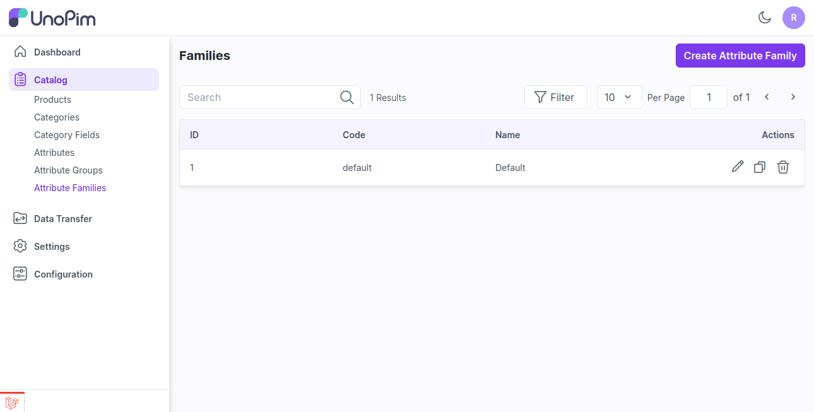
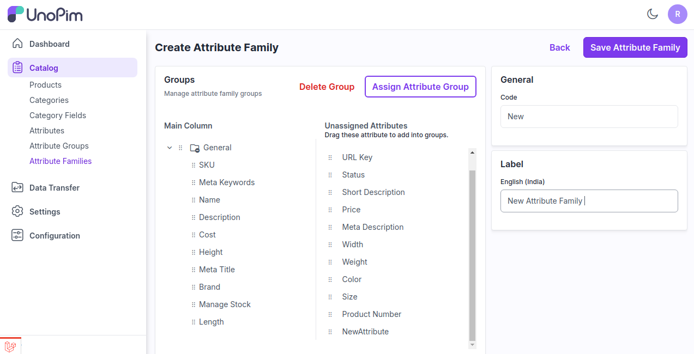
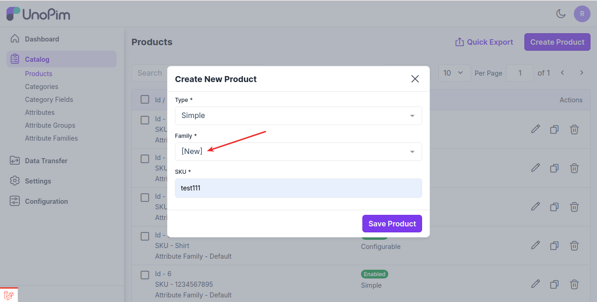

# 속성 패밀리

속성 패밀리를 사용하면 제품에 필요한 모든 정보를 한 번에 가져올 수 있습니다.

이는 고유한 제품과 관련된 속성 목록으로 지정할 수 있습니다. 여기서는 UnoPim의 제품 속성 패밀리에 대한 튜토리얼을 설명합니다.

### UnoPim에서 속성 패밀리 생성하기

**1단계**: 관리자 대시보드에서 **카탈로그** >> **속성 패밀리** >> **속성 패밀리 생성**을 클릭합니다.

 

**2단계**: 이제 할당되지 않은 속성에서 드래그 앤 드롭하여 새로운 속성 패밀리에 속성을 할당합니다.

그런 다음 아래 이미지와 같이 **속성 패밀리 코드**와 **이름**을 입력합니다.

 

마지막으로 **속성 패밀리 저장** 버튼을 클릭합니다.

이제 패밀리를 생성한 후 새로운 속성 패밀리가 아래 이미지와 같이 속성 패밀리 데이터그리드에 표시됩니다.

 

이후 제품 생성 과정에서 출력을 확인하면 새로운 속성 패밀리를 볼 수 있습니다. 이제 이 속성 패밀리에 속하는 모든 속성이 제품 페이지에 표시됩니다.

 

위 단계를 따르면 UnoPim에서 쉽게 **속성 패밀리**를 생성할 수 있습니다.