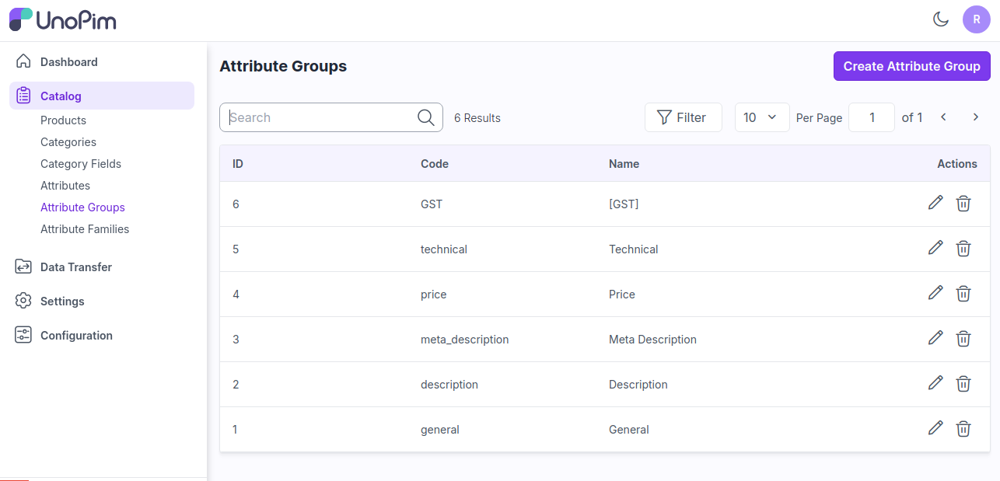
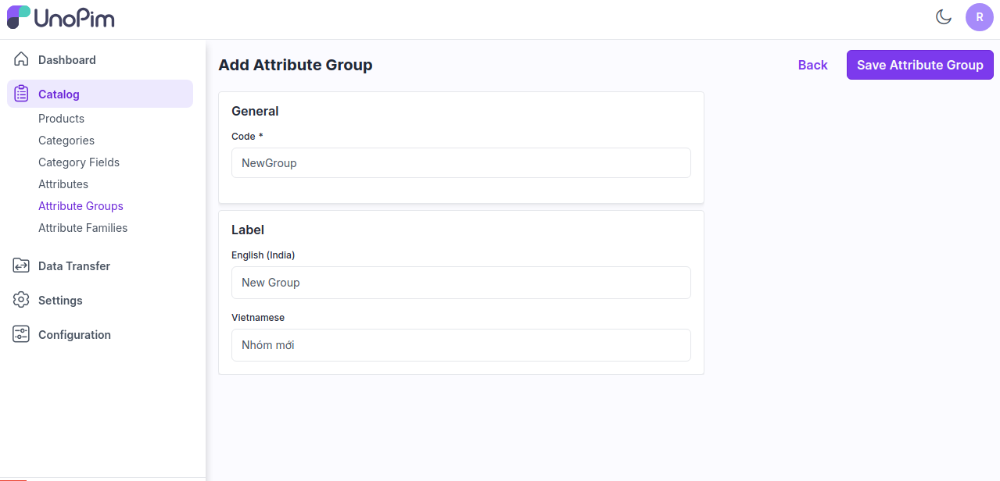
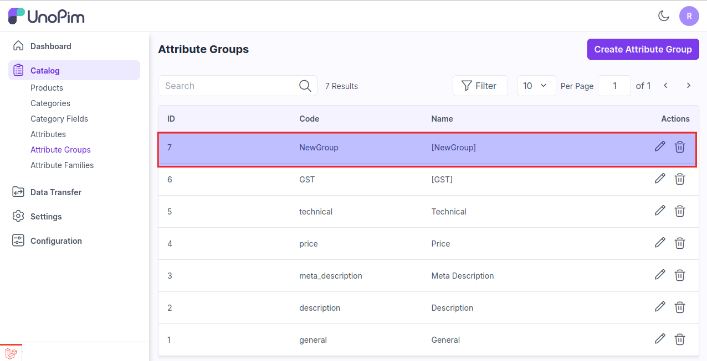
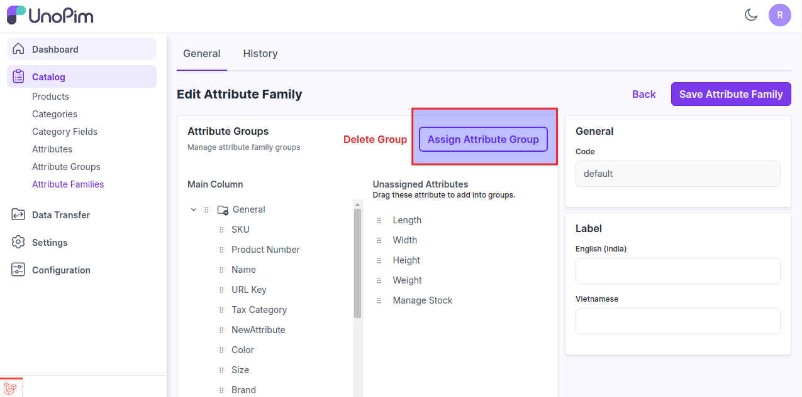
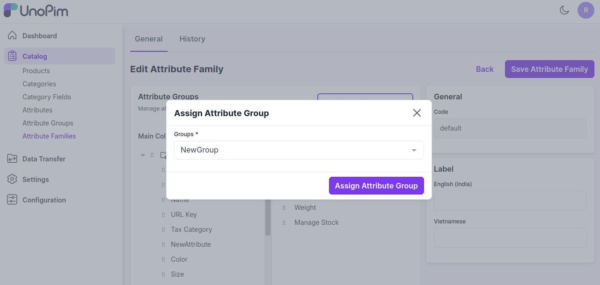
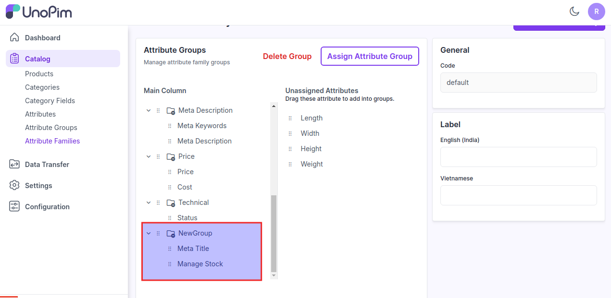
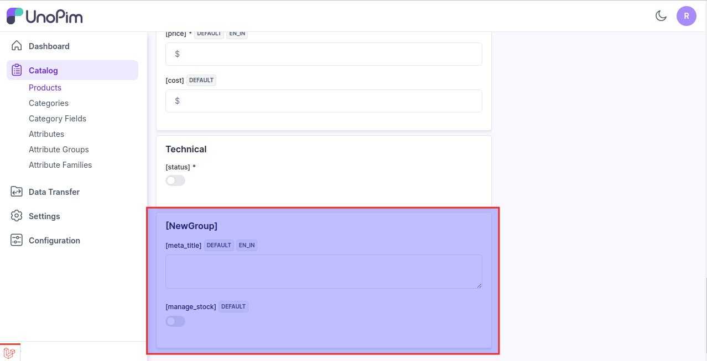

# 속성 그룹

속성 그룹은 사용자가 값을 입력할 때 더 나은 가시성을 제공하기 위해 속성들을 함께 모으는 데 사용됩니다.

제품에 대한 다양한 기여자들의 작업을 체계적으로 구성합니다.

### UnoPim에서 속성 그룹 생성하기

**1단계**: 관리자 대시보드에서 아래와 같이 **카탈로그** >> **속성 그룹** >> **속성 그룹 생성**을 클릭합니다.

 

**2단계**: 이제 그룹의 **코드**와 **레이블**을 추가한 후 아래 이미지와 같이 **속성 그룹 저장**을 클릭합니다.

 

이제 아래 이미지와 같이 **새로운 속성 그룹**이 생성됩니다.

 

**3단계**: 이제 이 그룹을 할당하려면 **카탈로그 >> 속성 패밀리 >> 기본 속성 패밀리 편집**을 클릭하고 아래 이미지와 같이 **속성 그룹 할당**을 클릭합니다.

 

**4단계**: 이제 그룹을 선택하고 아래와 같이 **속성 그룹 할당** 버튼을 클릭합니다.

 

새로운 그룹이 메인 콘텐츠에 성공적으로 생성됩니다.

 

관리자 대시보드에서 **카탈로그 >> 제품 >> 제품 생성**을 클릭합니다.

이제 제품에 이 그룹에 속한 속성이 하나 이상 있다면, 그룹이 제품 양식에 자동으로 나타납니다.

 

