# 제품 속성

속성은 제품의 사양 또는 특성을 의미합니다. 예를 들어, 티셔츠의 색상, 사이즈, 패턴 등이 속성에 해당합니다.

하나의 제품에 대해 여러 속성을 생성할 수 있습니다. 제품 속성은 매우 중요한 요소입니다.

### UnoPim에서 제품 속성 생성 방법

UnoPim 속성을 생성하려면 관리자 패널을 열고 아래 단계를 따르세요.

### 속성 추가

**1단계**: 아래 이미지와 같이 **카탈로그** >> **속성** >> **속성 생성**을 클릭합니다.

 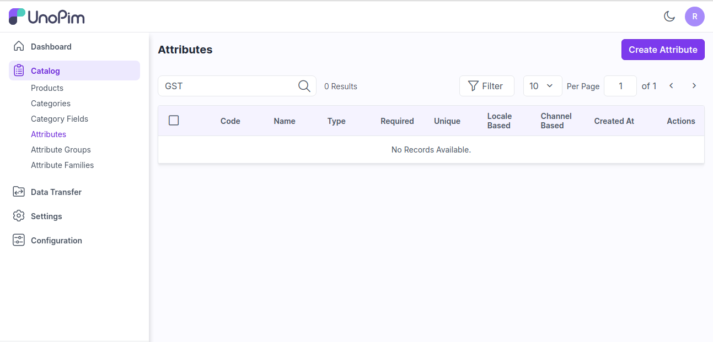

**2단계**: 일반 섹션에서 **코드**와 **데이터 타입**을 입력합니다.

   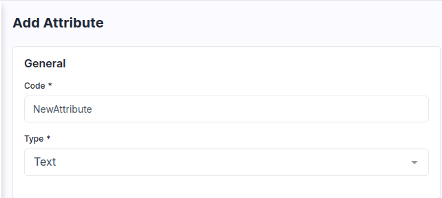

**참고**: **고유 여부(Is Unique)** 검증은 **텍스트, 날짜/시간, 날짜** 타입에서만 사용할 수 있습니다.

**3단계**: 아래 이미지와 같이 속성의 라벨을 입력합니다.

   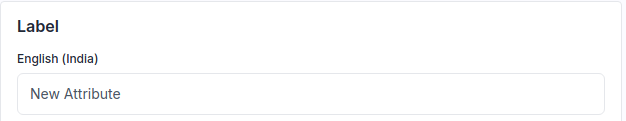

**4단계**: 속성을 필수 입력 또는 고유 값으로 만들고 싶다면 검증 항목을 선택합니다.

**참고**: **고유 여부(Is Unique)** 검증은 **텍스트, 날짜/시간, 날짜** 타입에서만 사용할 수 있습니다.

   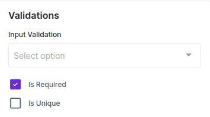

**5단계**: 로케일별 값, 채널별 값으로 속성 값을 관리하고 싶다면 해당 항목을 선택합니다.

   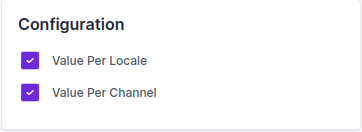

이제 **속성 저장** 버튼을 클릭하면 속성이 데이터그리드에 성공적으로 생성됩니다.

   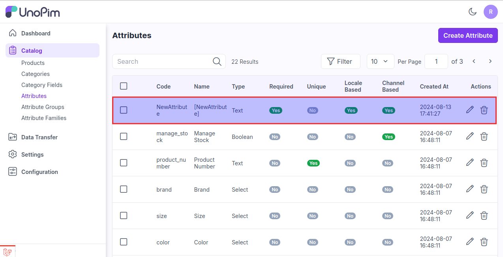

이제 **속성 저장** 후 **카탈로그 >> 속성 패밀리**로 이동하여, 할당되지 않은 속성에서 원하는 위치로 드래그 앤 드롭하여 할당합니다.

   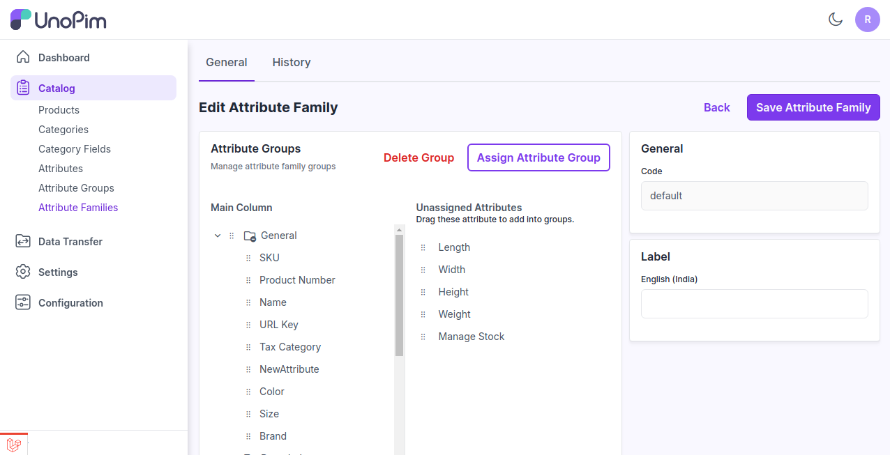

이제 **속성 패밀리 저장** 후, 제품 편집 페이지에서 제품 생성 시 결과를 확인할 수 있습니다.

   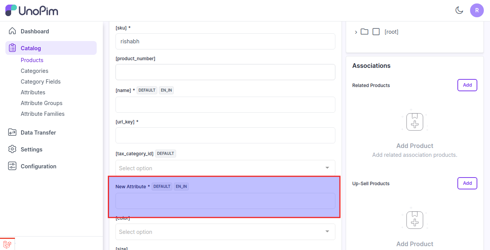

### UnoPim 12가지 제품 데이터 타입 시각적 안내

**1) 텍스트** - 한 줄의 텍스트를 입력할 수 있는 필드입니다. 이름, 이메일, 검색어 등 짧은 입력에 사용됩니다.

   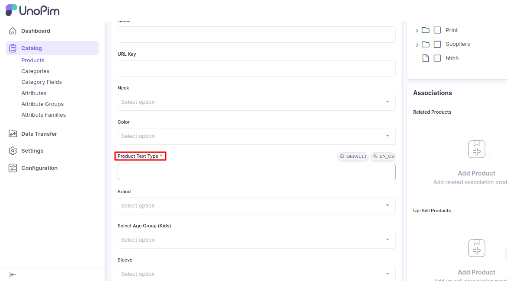

**2) 텍스트영역** - 여러 줄의 텍스트를 입력할 수 있는 넓은 영역입니다. 설명, 메시지 등 긴 입력에 적합합니다.

또한 Wysiwyg 에디터를 활성화/비활성화할 수 있습니다.

   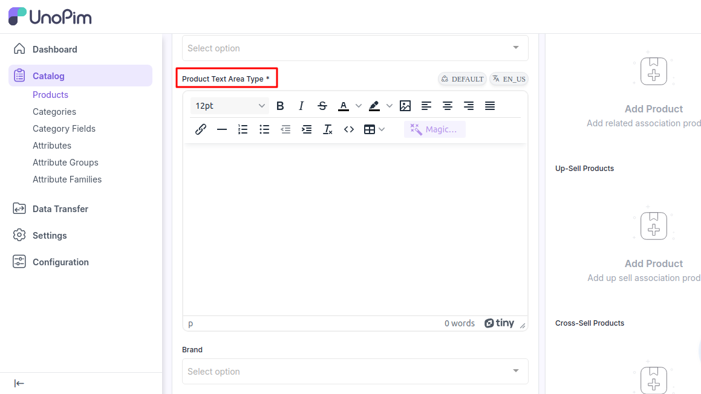

**3) 불리언** - 참/거짓 값을 나타냅니다. 예/아니오, 켬/끔 선택에 자주 사용됩니다.

   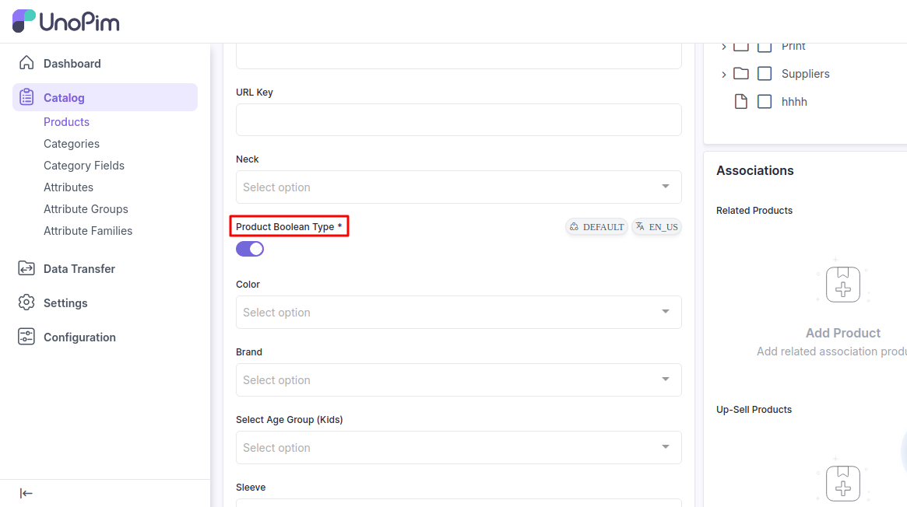

**4) 선택** - 미리 정의된 옵션 중 하나를 선택할 수 있는 드롭다운 메뉴입니다.

   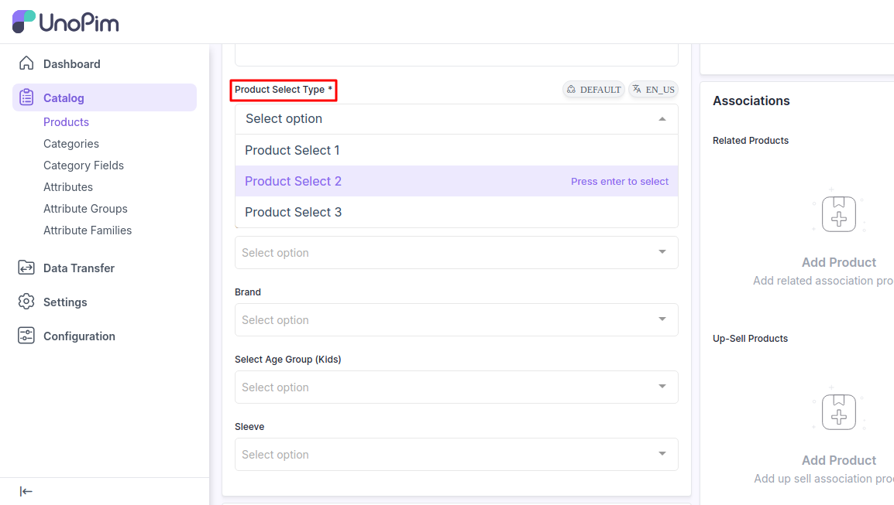

**5) 다중 선택** - 여러 옵션을 선택할 수 있는 드롭다운 메뉴입니다.

   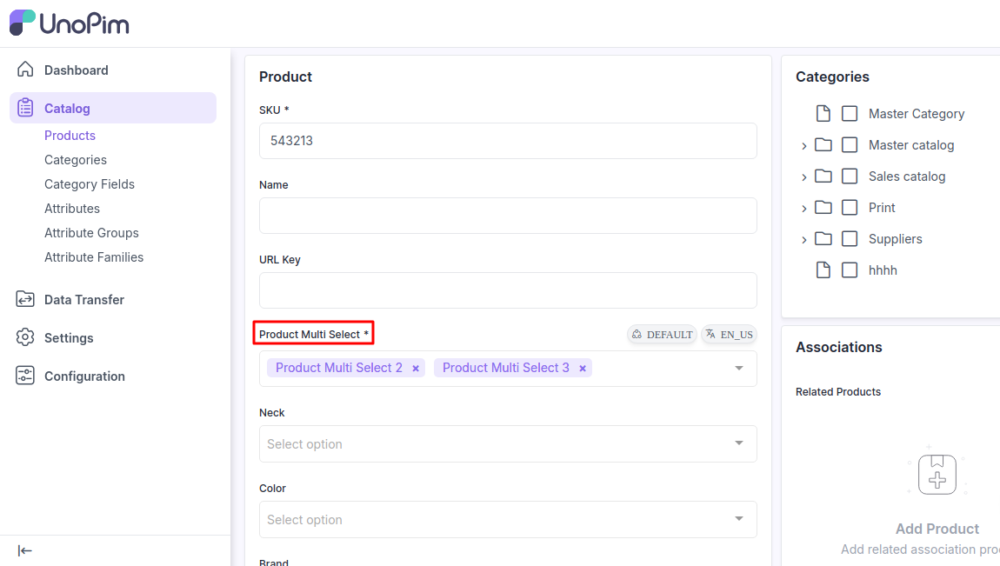

**6) 날짜/시간** - 날짜와 시간을 선택할 수 있는 필드입니다. 주로 일정 예약, 타임스탬프 등에 사용됩니다.

   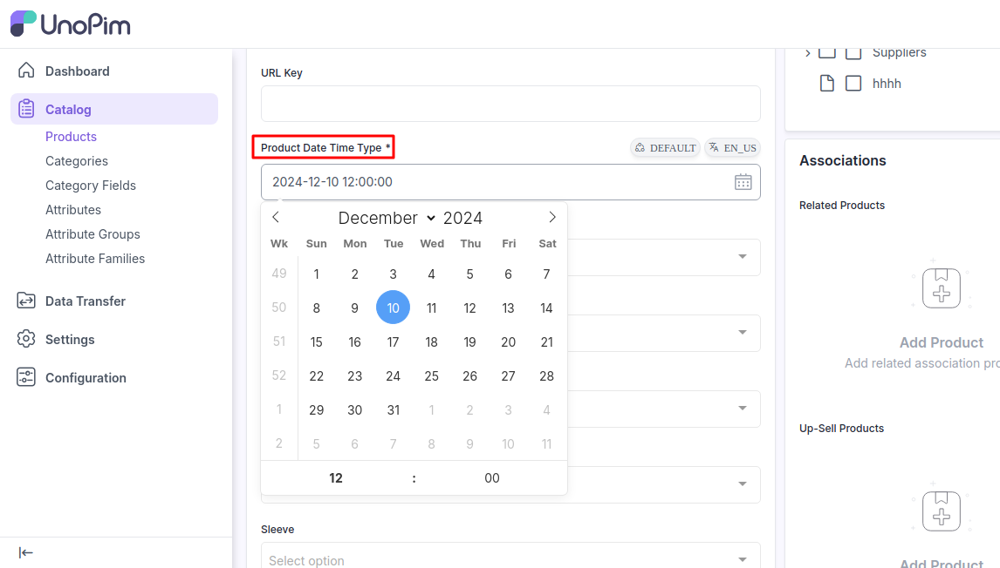

**7) 날짜** - 날짜만 입력 또는 선택할 수 있는 필드입니다. 폼, 달력 등에서 특정 날짜 선택에 사용됩니다.

   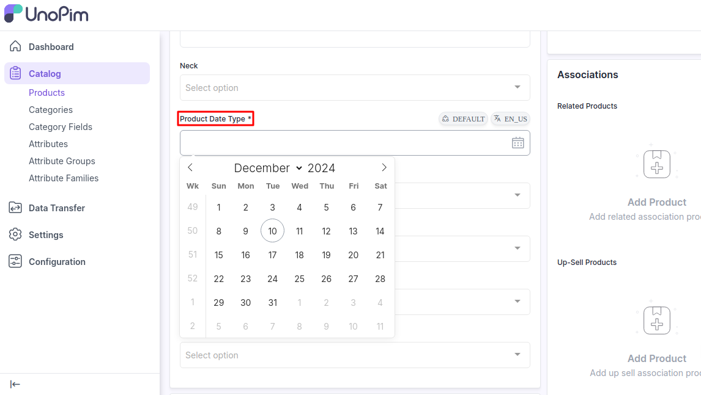

**8) 갤러리** - 제품당 여러 이미지를 관리하고 표시할 수 있는 갤러리 속성으로, 제품 미디어 경험을 향상시킵니다.

1) 미디어 속성을 통해 갤러리 이미지를 위치 변경 없이 편집할 수 있습니다.
2) 갤러리 이미지를 드래그 앤 드롭하여 위치를 변경할 수 있습니다.

   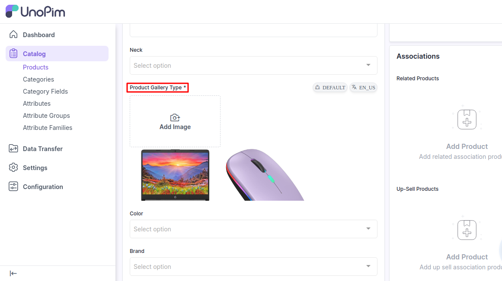

**9) 이미지** - 이미지를 업로드하거나 표시할 수 있는 필드입니다. 사용자는 이미지를 업로드하거나 이미 업로드된 이미지를 볼 수 있습니다.

   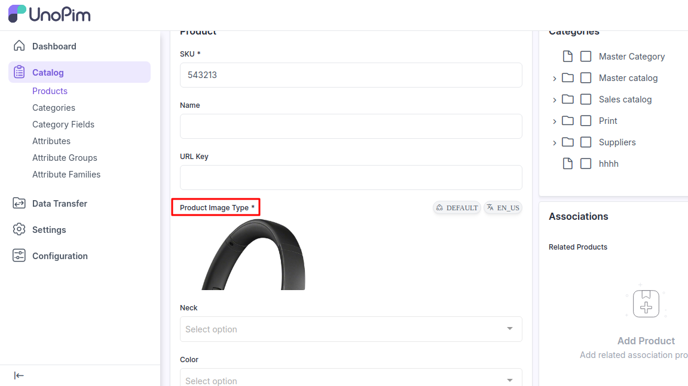

**10) 파일** - 파일을 업로드할 수 있는 필드입니다. 문서, 이미지, 기타 파일 형식을 지원합니다.

   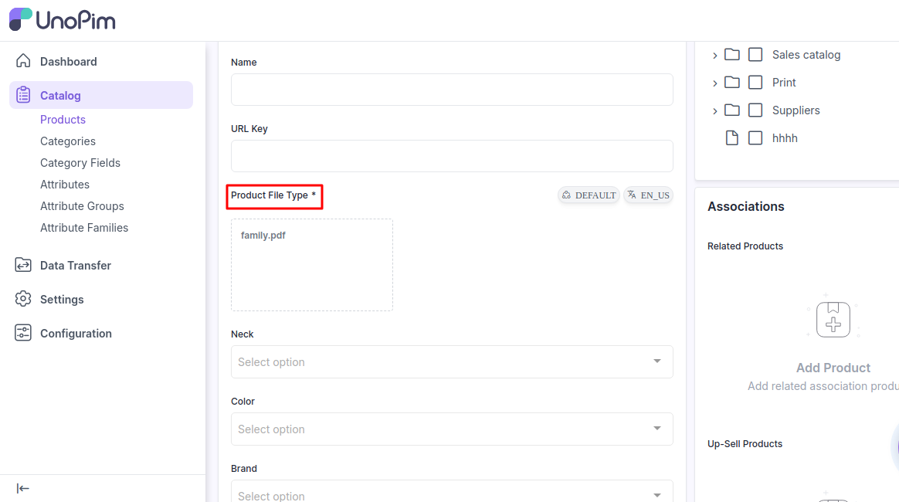

**11) 체크박스** - 선택 또는 해제할 수 있는 작은 박스입니다. 동의, 선호도 등 이진 선택에 사용됩니다.

   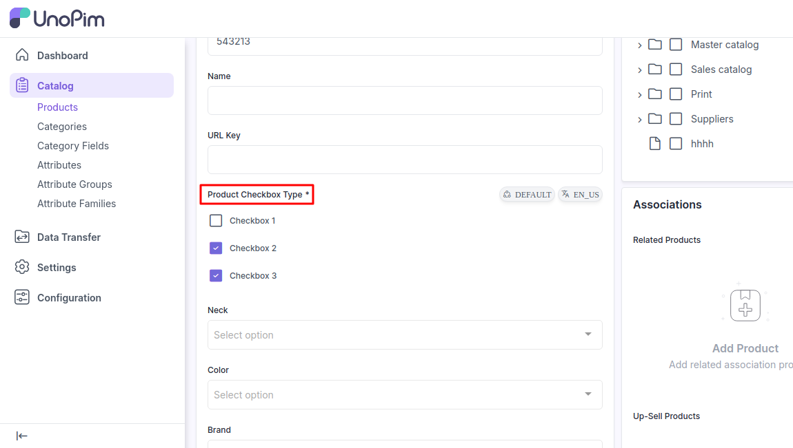

**12) 가격** - 미리 정의된 속성인 가격 외에 추가 가격 필드를 생성할 때 사용하는 입력 유형입니다.

   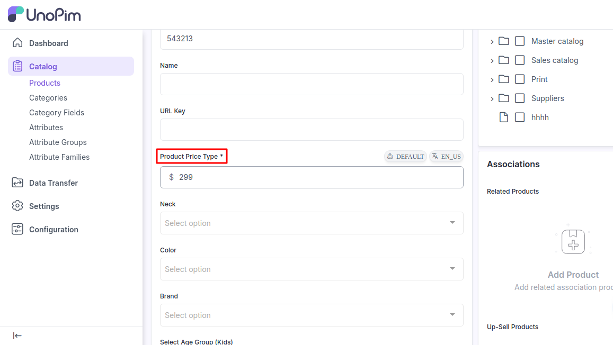

위 단계를 따르면 UnoPim에서 **제품 속성**을 쉽게 생성할 수 있습니다.

