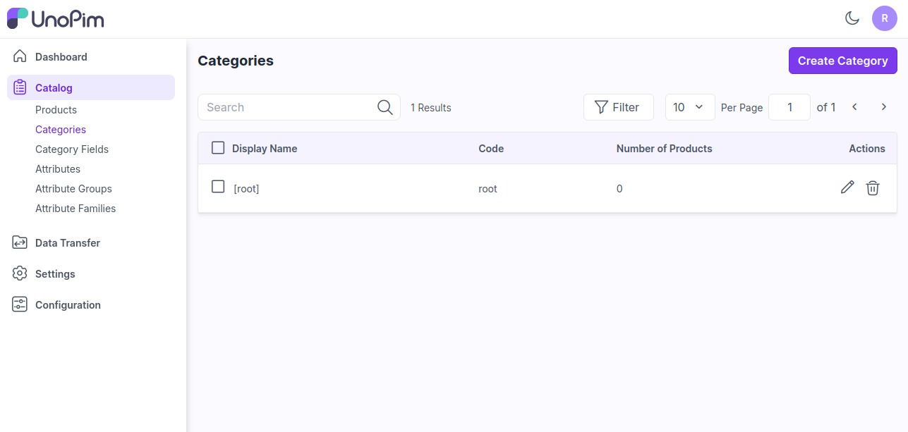
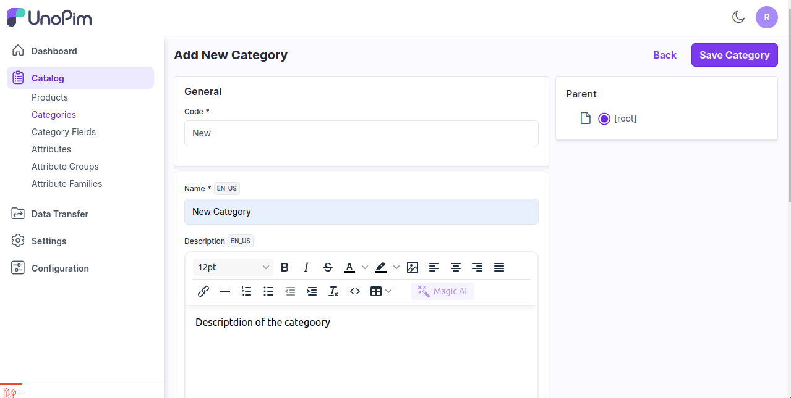
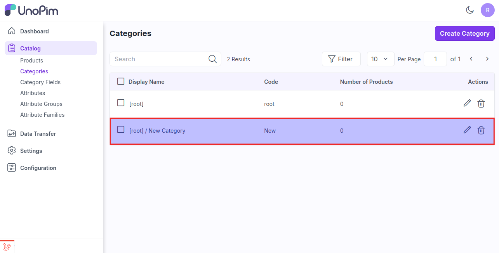

# 카테고리

카테고리는 카탈로그의 구조를 의미합니다. 카테고리를 생성하면 고객이 원하는 제품을 쉽게 찾을 수 있습니다. 계층적 구조를 만들 때 사용됩니다.

여기서는 UnoPim에서 새로운 카테고리를 생성하는 단계를 안내합니다.

### 루트 카테고리

[UnoPim](https://unopim.com/)에는 기본 루트 카테고리가 제공됩니다. 루트 카테고리는 하위 카테고리를 담는 컨테이너 역할을 합니다.

### UnoPim에서 새 카테고리 생성 단계

1. 아래 이미지와 같이 **카탈로그 >> 카테고리 >> 카테고리 생성**을 클릭합니다.

   

2. **코드, 이름, 설명** 등 일반 정보를 입력합니다. 필요하다면 하위 카테고리를 루트 등 상위 카테고리에 할당할 수도 있습니다.

   

3. 카테고리를 저장하면, 아래 이미지와 같이 데이터 그리드에 '새 카테고리'라는 이름으로 카테고리가 생성됩니다.

    
