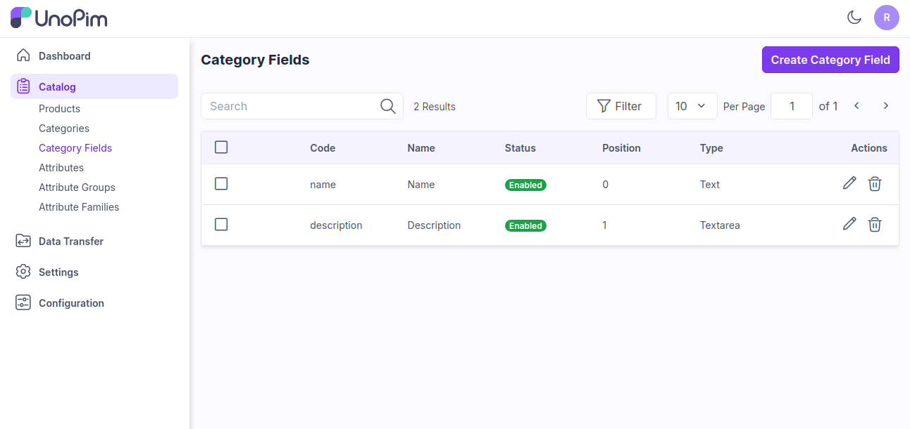
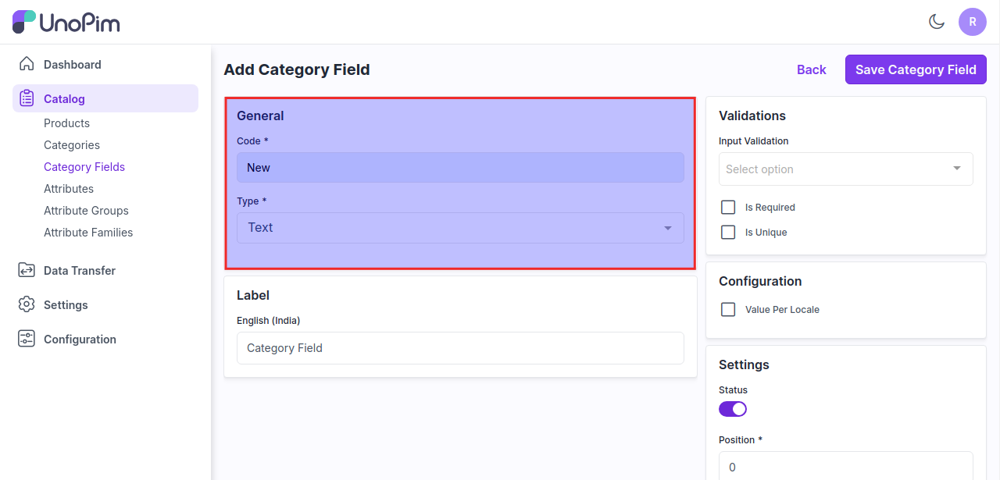
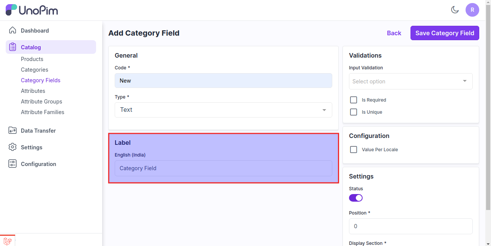
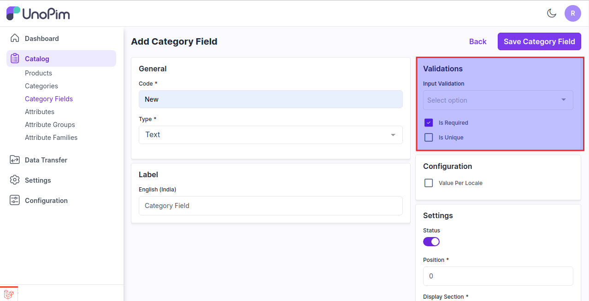
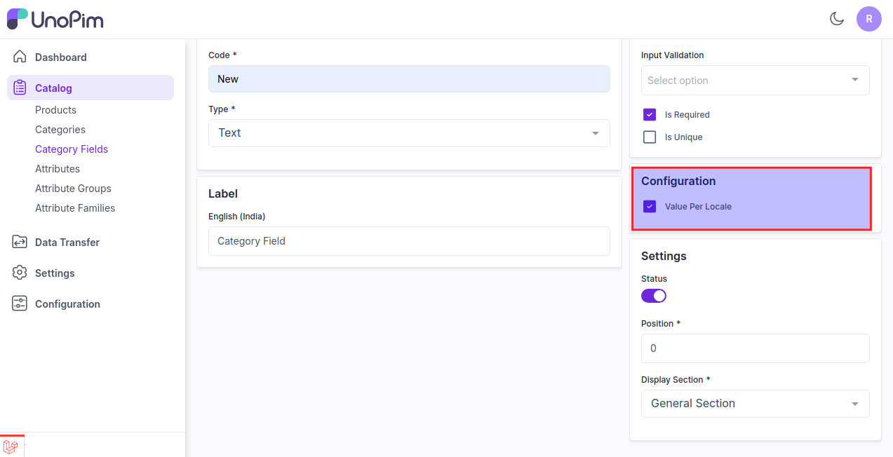
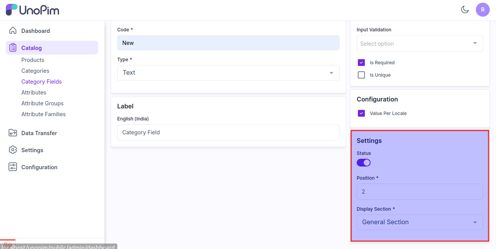
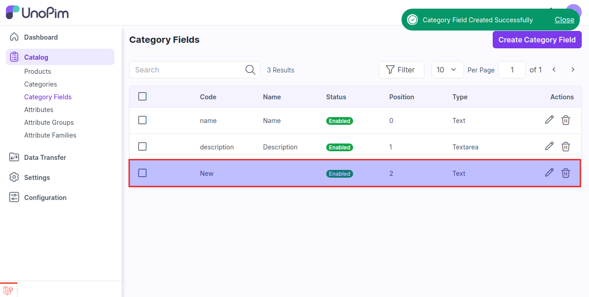
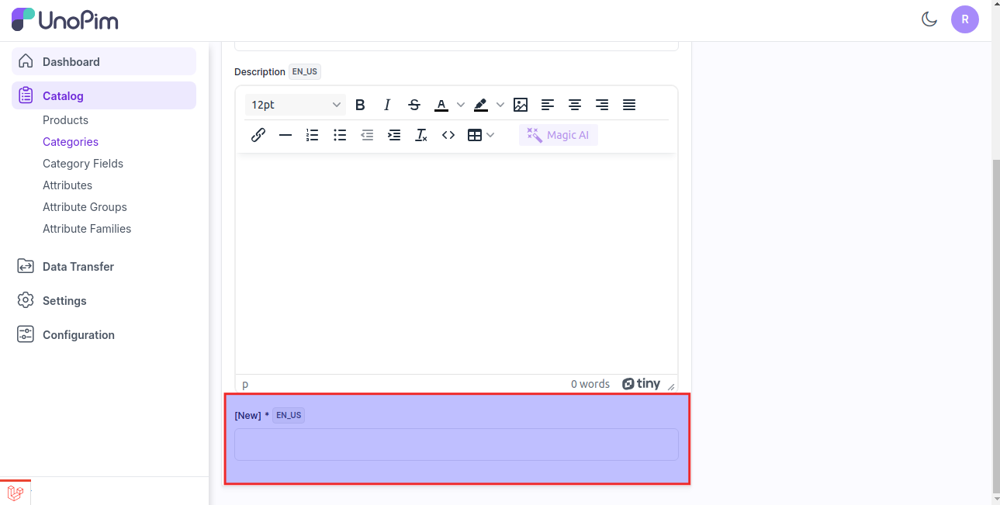

# 카테고리 필드

카테고리 필드는 제품의 속성과 유사하지만, 카테고리에서 사용됩니다.

카테고리 필드는 일반적으로 항목을 분류하거나 조직하는 데 사용되는 특정 속성 또는 정보 유형을 의미합니다.

### UnoPim에서 카테고리 필드 생성 단계

1) 아래 이미지와 같이 **카탈로그 >> 카테고리 필드 >> 카테고리 필드 클릭** 버튼을 클릭합니다.

   

2) 일반 섹션에서 **코드**와 **유형**을 입력합니다.

### UnoPim 기본 제공 10가지 유형

**1) 텍스트** - 한 줄의 텍스트를 입력할 수 있는 필드입니다. 이름, 이메일, 검색어 등 짧은 입력에 사용됩니다.

**2) 텍스트영역** - 여러 줄의 텍스트를 입력할 수 있는 넓은 영역입니다. 설명, 메시지 등 긴 입력에 적합합니다.

**3) 불리언** - 참/거짓 값을 나타냅니다. 예/아니오, 켬/끔 선택에 자주 사용됩니다.

**4) 선택** - 미리 정의된 옵션 중 하나를 선택할 수 있는 드롭다운 메뉴입니다.

**5) 다중 선택** - 여러 옵션을 선택할 수 있는 드롭다운 메뉴입니다.

**6) 날짜/시간** - 날짜와 시간을 선택할 수 있는 필드입니다. 주로 일정 예약, 타임스탬프 등에 사용됩니다.

**7) 날짜** - 날짜만 입력 또는 선택할 수 있는 필드입니다. 폼, 달력 등에서 특정 날짜 선택에 사용됩니다.

**8) 이미지** - 이미지를 업로드하거나 표시할 수 있는 필드입니다. 사용자는 이미지를 업로드하거나 이미 업로드된 이미지를 볼 수 있습니다.

**9) 파일** - 파일을 업로드할 수 있는 필드입니다. 문서, 이미지, 기타 파일 형식을 지원합니다.

**10) 체크박스** - 선택 또는 해제할 수 있는 작은 박스입니다. 동의, 선호도 등 이진 선택에 사용됩니다.

**참고**: **고유 여부(Is Unique)** 검증은 **텍스트, 날짜/시간, 날짜** 타입에서만 사용할 수 있습니다.

   

3) 아래 이미지와 같이 카테고리 필드의 라벨을 입력합니다.

   

4) 카테고리 필드를 필수 입력 항목으로 만들고 싶다면 검증 항목을 선택합니다.

   

5) 카테고리별로 로케일에 따라 필드 값을 관리하고 싶다면 해당 항목을 선택합니다.

이렇게 하면 카테고리에서 다양한 로케일에 대해 카테고리 필드를 관리할 수 있습니다.

   

6) 설정 옵션에서 필드의 **상태**를 활성화하고, 필드의 **위치**(정렬 순서)를 입력한 뒤, 표시 섹션을 일반 섹션 또는 구성 가능 섹션으로 선택합니다.

   

마지막으로 **카테고리 필드 저장** 버튼을 클릭하면 아래 이미지와 같이 새로운 카테고리 필드가 성공적으로 생성됩니다.

   

이제 **카탈로그 >> 카테고리 >> 카테고리 생성**으로 이동하면, 카테고리 생성 또는 수정 시 **새 카테고리 필드**를 확인할 수 있습니다.

   

