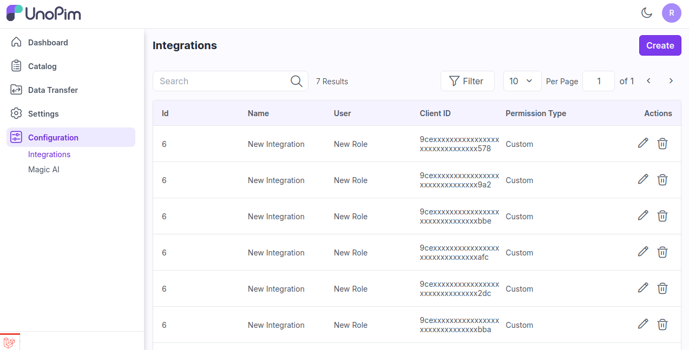

# 통합

UnoPim에서의 통합은 제품 데이터가 다양한 시스템과 채널에서 일관되고 정확하며 쉽게 접근할 수 있도록 하는 데 중요합니다. 

### UnoPim에서 통합 단계

**1단계**: UnoPim의 관리자 패널로 이동하여 **설정 >> 통합**을 클릭한 후 **생성** 버튼을 클릭합니다.

   

**2단계**: 아래 필드를 추가합니다.

1) **권한**: **사용자 정의** 또는 **모두** 옵션에서 권한을 선택합니다.

* **사용자 정의**: 메뉴를 요구 사항에 맞게 표시하려면 사용자 정의 옵션을 선택합니다. 

* **모두**: 모든 메뉴를 표시하려면 모두 옵션을 선택합니다.

2) **이름**: 통합의 이름을 입력합니다.

3) **사용자 할당**: 통합에 사용자를 할당합니다.

   

**3단계**: 이제 아래와 같이 자격 증명을 생성할 수 있는 옵션이 표시됩니다.

   

**4단계**: **생성** 버튼을 클릭하여 API 키를 생성합니다.

   

**5단계**: 이제 할당된 사용자에 대한 통합이 아래 이미지와 같이 데이터그리드에 성공적으로 생성됩니다.

   

이를 통해 UnoPim에서 API 통합을 쉽게 생성할 수 있습니다.