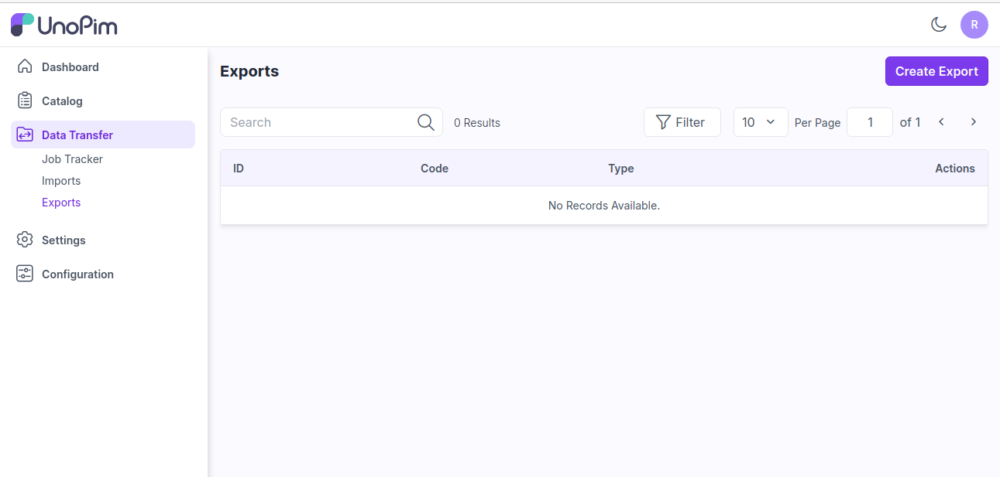
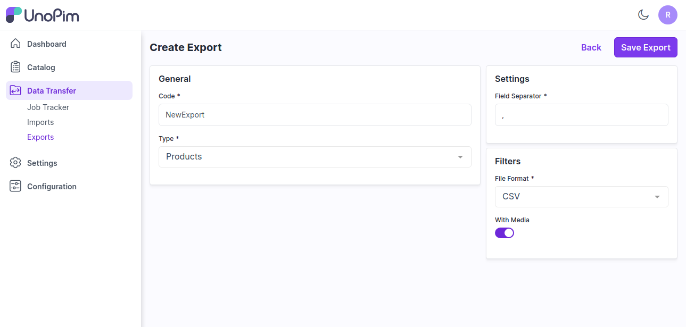
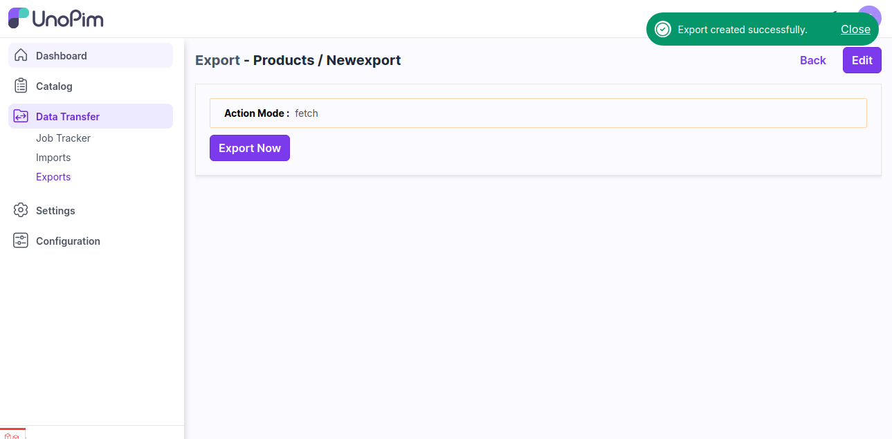
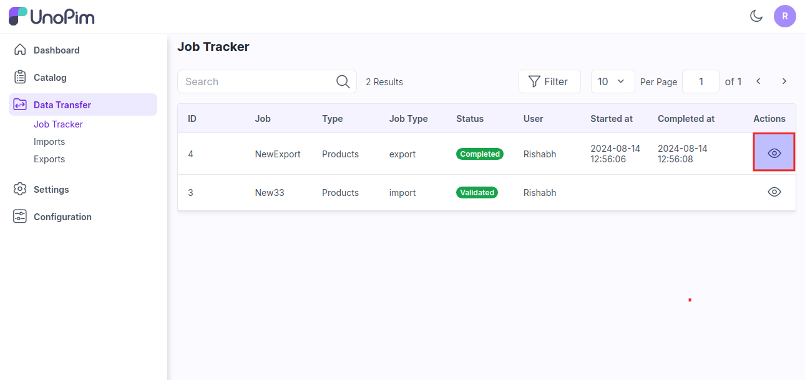
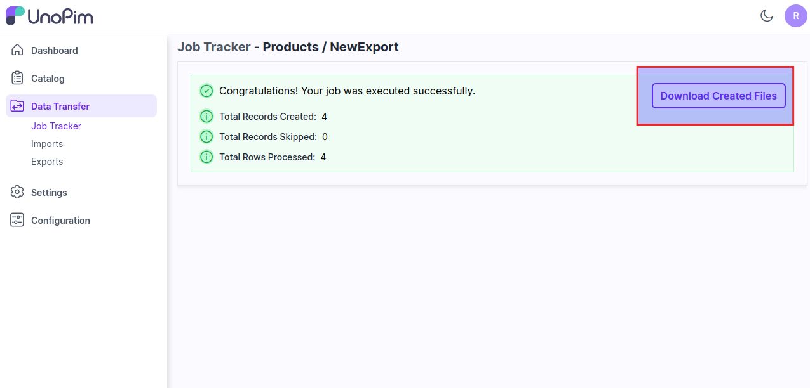

# 내보내기

데이터를 파일로 저장하여 정보를 관리, 분석, 공유하는 것은 일반적인 관행입니다. 이는 데이터를 소스 시스템에서 저장, 향후 사용 또는 다른 사람과 공유하기에 적합한 파일 형식으로 전송하는 것을 포함합니다. 

### UnoPim에서 대량 내보내기 추가하는 단계

**1단계:** UnoPim의 관리자 패널로 이동하여 **데이터 전송 >> 내보내기**를 클릭하고 내보내기 생성 버튼을 클릭합니다.

   

**2단계:** 일반 구성에서 다음 필드를 추가합니다.

1) **코드 -** 내보내기 프로세스의 코드를 입력합니다.

2) **유형 -** 내보내려는 유형(제품, 카테고리 등)을 선택합니다.

3) **필드 구분자 -** 이 기능을 사용하여 필드를 설정할 수 있습니다. 예를 들어 **","**를 필드 구분자로 사용하면 파일 내의 데이터가 이를 기준으로 구분됩니다.

4) **필터 -** 드롭다운에서 요구 사항에 맞는 파일 형식(**CSV, XLS, XLSX**)을 선택합니다.

5) **미디어 포함 -** 미디어를 포함하거나 제외하여 내보내기 데이터를 활성화하거나 비활성화합니다.

이제 **내보내기 저장** 버튼을 클릭합니다.

   

**3단계:** 아래 이미지와 같이 **지금 내보내기** 버튼을 클릭합니다.

   

**4단계:** **데이터 전송 >> 작업 추적기**를 클릭하여 내보내기 프로세스의 상태를 확인합니다. 상태가 완료되면 내보내기 프로세스가 성공적으로 완료된 것입니다.

이제 아래 이미지와 같이 작업을 클릭하여 내보내기 데이터를 확인합니다.

   

**5단계:** 여기서 내보내기 파일을 쉽게 다운로드할 수 있습니다.

   

위의 단계를 통해 UnoPim에서 쉽게 데이터 내보내기를 생성할 수 있습니다.   

