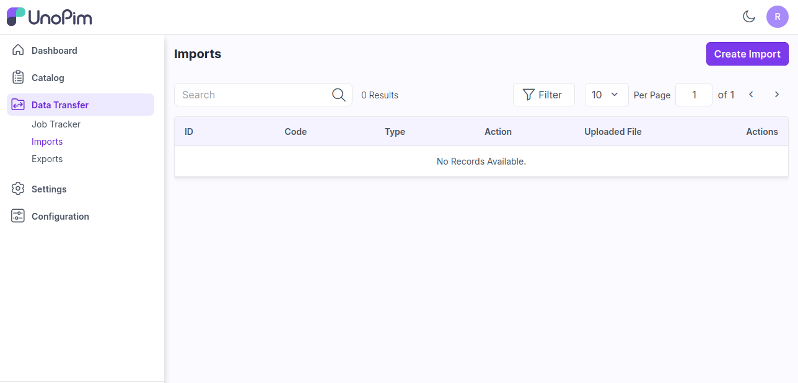
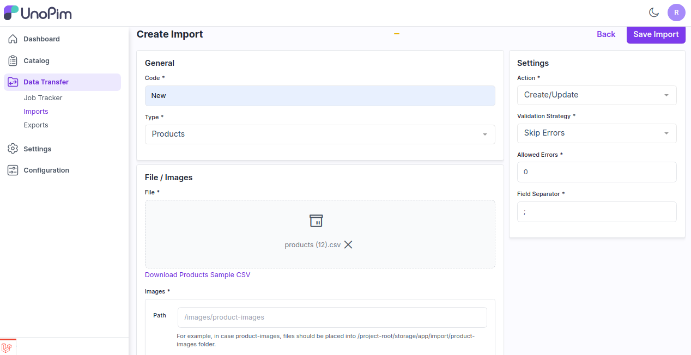
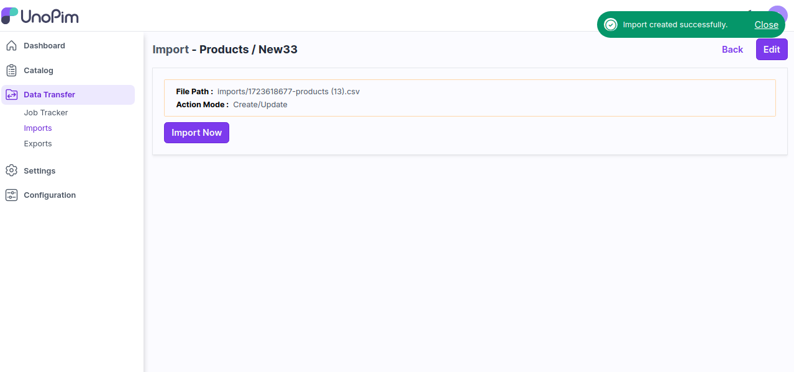
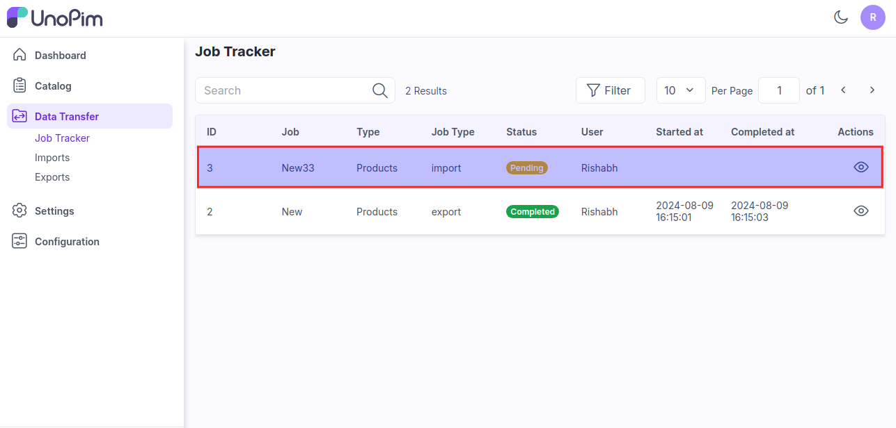

# 가져오기

대량 가져오기는 사용자가 시스템에 대량의 데이터를 빠르고 효율적으로 가져올 수 있게 해주는 기능입니다. 각 정보를 하나씩 추가할 필요 없이 프로세스를 단순화하고 시간을 절약할 수 있습니다.

이 기능은 각 시스템마다 다르게 작동하며, 많은 산업 분야와 [UnoPim](https://unopim.com/)에서 다양한 용도로 사용됩니다.

### UnoPim에서 대량 가져오기 추가하는 단계

**1단계:** UnoPim의 관리자 패널로 이동하여 **데이터 전송 >> 가져오기 >> 가져오기 생성**을 클릭합니다.

   

**2단계:** 일반 구성에서 다음 필드를 추가합니다:

1) **코드 -** 가져오기 프로세스의 코드를 입력합니다.

2) **유형 -** 가져오려는 유형(제품, 카테고리 등)을 선택합니다.

3) **파일 -** 원하는 형식(**CSV, XLS, XLSX**)의 파일을 선택하고, 파일에 필요한 모든 필드가 있는지 확인합니다.

4) **샘플 다운로드 -** 유형(제품, 카테고리)의 샘플 파일을 다운로드할 수도 있습니다. 업로드하는 파일이 이 샘플 파일과 유사한지 확인하세요.

5) **이미지 디렉토리 경로 -** 제품 이미지 파일은 **/project-root/storage/app/import/product-images** 폴더에 배치해야 합니다.

6) **작업 -** 설정 구성에서 레코드를 생성/업데이트하거나 삭제할지 선택합니다.

7) **유효성 검사 전략 -** 이 고유한 기능을 사용하면 데이터 가져오기 중 오류를 건너뛰거나 오류에서 중지할 수 있습니다.

8) **허용된 오류 -** 이 기능을 사용하면 데이터 가져오기 중 무시될 오류의 수량을 설정할 수 있습니다.

9) **필드 구분자 -** 이 기능을 사용하여 필드를 설정할 수 있습니다. 예를 들어 **","**를 필드 구분자로 사용하면 파일 내의 데이터가 이를 기준으로 구분됩니다.

이제 **가져오기 저장** 버튼을 클릭합니다.

   

**3단계:** 아래 이미지와 같이 **지금 가져오기** 버튼을 클릭합니다.

   

**4단계:** **데이터 전송 >> 작업 추적기**를 클릭하여 가져오기 프로세스의 상태를 확인합니다. 상태가 완료되면 가져오기 프로세스가 성공적으로 완료된 것입니다.

또한 UnoPim 루트에서 다음 명령을 실행할 수 있습니다.

**php artisan queue:listen**

   

위의 단계를 통해 UnoPim에서 쉽게 데이터 가져오기를 생성할 수 있습니다.