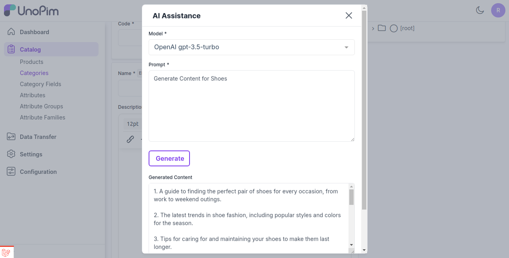

# Magic AI

Magic AI는 효율성을 향상시키고자 하는 다양한 분야의 전문가를 위한 궁극적인 도구입니다.

UnoPim은 관리에 인공 지능을 사용하는 Magic AI를 통합했습니다.

제품 콘텐츠 생성을 위한 Magic AI. 고급 LLM(대규모 언어 모델) 기술을 사용하여 매력적인 제품 콘텐츠를 자동으로 생성합니다.

## 콘텐츠 생성

Magic AI를 사용하면 **제품 및 카테고리** 콘텐츠를 쉽게 생성할 수 있습니다.

### UnoPim은 다양한 LLM에 대한 네이티브 지원을 제공합니다.

**A) 콘텐츠용 -** OpenAI GPT-4o, OpenAI GPT-4o Mini, Mistral, Phi-4, Starling, Starling LM, LLaMA 3.3 (70B), LLaMA 3.2 (90B, 11B), LLaMA 3.1 (8B), Orca Mini, Vicuna, LLaVA, Qwen 2.5, Groq (xAI)

Magic AI가 매력적이고 독특한 설명을 만들어내므로 시간이 많이 걸리는 수동 콘텐츠 생성에 작별을 고하세요. 이는 귀중한 시간과 노력을 절약해 줍니다.

