# 구성 가능한 제품

이는 고객이 선택할 수 있는 크기, 색상 또는 기능과 같은 다양한 옵션이나 변형을 제공하는 제품 유형을 말합니다. PIM 시스템은 이러한 옵션과 관련 속성을 관리하여 다양한 구성에 걸쳐 정확하고 포괄적인 제품 정보를 보장합니다.

구성 가능한 제품은 개별 요구 사항을 충족하도록 설계되어 [UnoPim](https://unopim.com/)에서 고객 만족도를 향상시키고 맞춤형 경험을 제공합니다.

### UnoPim에서 구성 가능한 제품 생성하기

1. **카탈로그 >> 제품 >>** 제품 유형에서 **구성 가능**, **패밀리**를 선택하고 **SKU**를 입력합니다.

 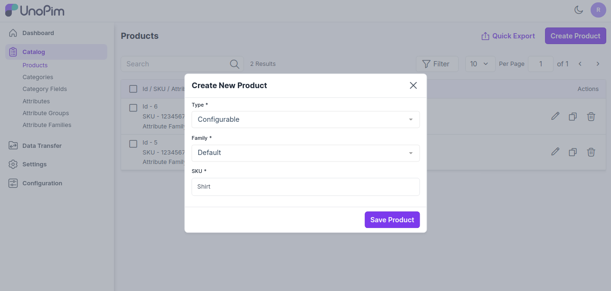 

이제 **제품 저장**을 클릭하고, 요구 사항에 따라 **구성 가능한 속성**을 선택한 다음 아래 이미지와 같이 **제품 저장** 버튼을 클릭합니다.

 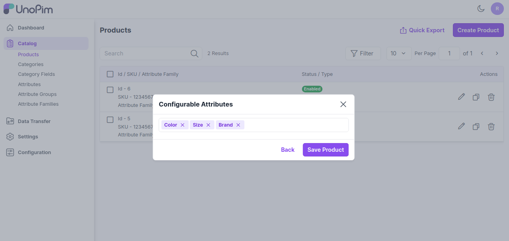 

### 일반 속성

제품의 패밀리에 할당된 속성이 속성 그룹별로 그룹화되어 표시됩니다.

아래는 "기본" 패밀리에 있는 필수 속성입니다.

1) 제품의 **SKU**를 입력합니다.

2) 제품의 **이름**을 입력합니다.

3) 제품의 **URL 키**를 입력합니다.

 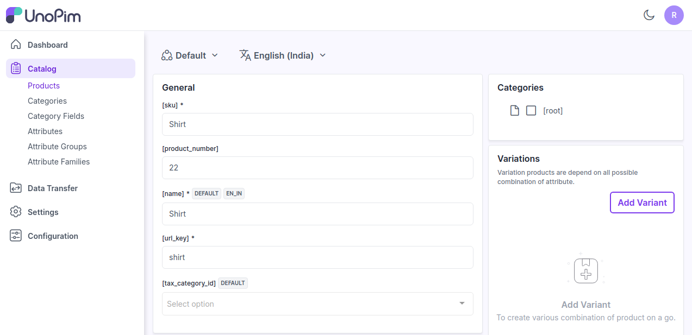

### 간단한 설명
제품의 특징에 대한 간단한 설명을 입력합니다.

### 설명
제품에 대해 자세히 설명합니다.

 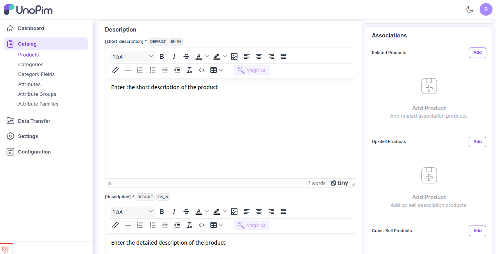 

### 기술적

아래와 같이 상태 옵션에서 제품을 활성화합니다.

  

### 카테고리

아래 이미지와 같이 제품을 루트 카테고리에 할당할 수도 있습니다.

 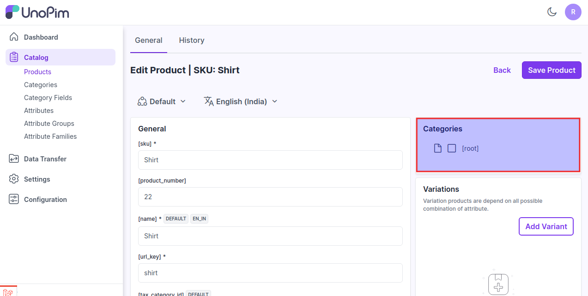 

### 변형

이제 아래 이미지와 같이 제품 추가를 클릭하여 제품의 변형을 입력합니다.

 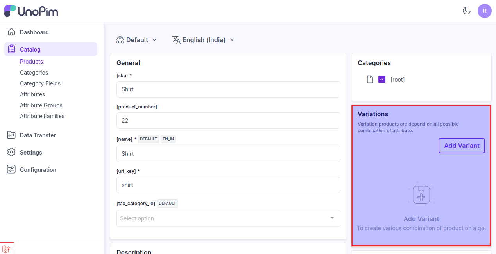 

이제 변형을 추가하고 구성 가능한 속성을 입력한 다음 아래 이미지와 같이 **추가 버튼**을 클릭합니다.

 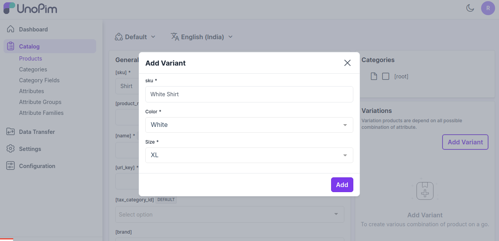 

제품의 요구 사항에 따라 원하는 만큼 많은 변형을 추가할 수 있습니다.

### 연관 제품

관련 제품, 업셀 제품, 크로스셀 제품을 추가할 수 있습니다.

**1) 관련 제품 -** 관련 제품은 선택한 제품과 유사한 제품입니다. 잠재적인 대체품을 표시하여 고객이 좋아할 만한 다른 유사 제품을 발견하는 데 도움을 줄 수 있습니다.

관련 제품을 추가하려면 관련 제품 섹션에서 추가를 클릭하고 아래 이미지와 같이 관련 제품으로 추가하려는 제품의 SKU를 통해 제품을 검색합니다.

 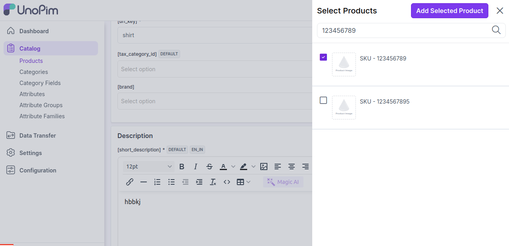 

이제 **선택한 제품 추가** 버튼을 클릭합니다.

**2) 업셀 제품 -** 업셀링은 고객이 관심 있는 제품의 고급 버전을 판매하는 방식입니다.

예를 들어, 전자제품 소매업자가 더 나은 TV, 더 빠른 노트북 또는 더 내구성 있는 태블릿의 이점을 지적하는 것이 업셀링의 예입니다.

업셀 제품을 추가하려면 업셀 제품 섹션에서 추가를 클릭하고 아래 이미지와 같이 업셀 제품으로 추가하려는 제품의 SKU를 통해 제품을 검색합니다.

  

이제 **선택한 제품 추가** 버튼을 클릭합니다.

**3) 크로스셀 제품 -** 크로스셀은 현재 제품을 기반으로 홍보하는 제품입니다. 일반적으로 보완적인 품목입니다. 예를 들어, 노트북을 판매하는 경우 크로스셀은 보호 케이스 스티커나 특별한 어댑터일 수 있습니다.

크로스셀 제품을 추가하려면 크로스셀 제품 섹션에서 추가를 클릭하고 아래 이미지와 같이 크로스셀 제품으로 추가하려는 제품의 SKU를 통해 제품을 검색합니다.

  

이제 **선택한 제품 추가** 버튼을 클릭합니다.

요구 사항에 따라 원하는 만큼 많은 제품을 추가할 수 있습니다.

마지막으로 **제품 저장**을 클릭합니다.

 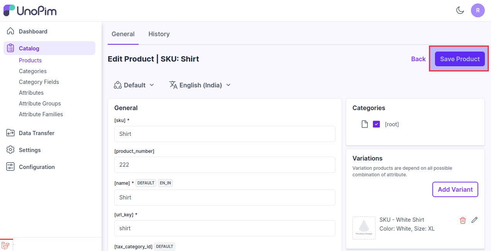 

이제 제품이 성공적으로 생성되었으며 아래 이미지와 같이 제품 데이터 그리드에 표시됩니다.

 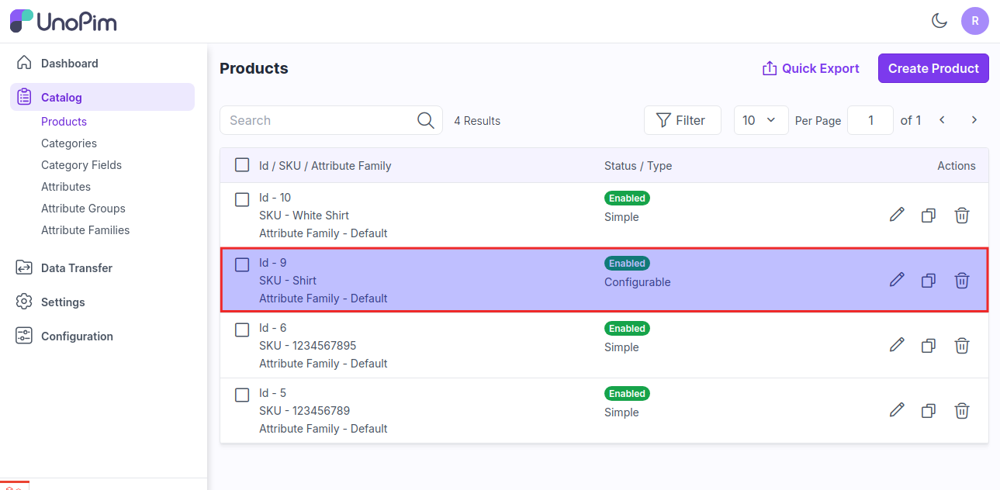 

또한 **카탈로그 >> 제품 >> 제품 편집**으로 이동하여 **기록**을 클릭하면 제품 기록을 볼 수 있습니다.

 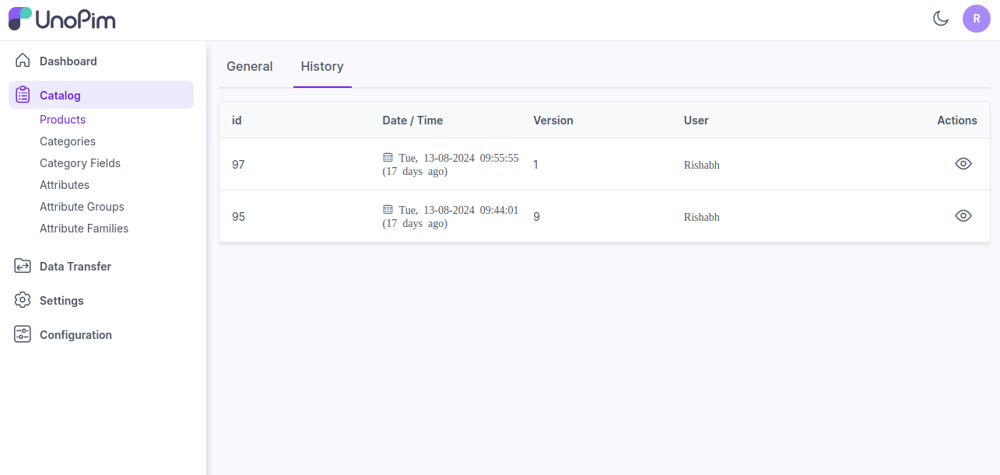 

그 후 **작업**에서 아래와 같이 제품 기록을 볼 수 있습니다.

 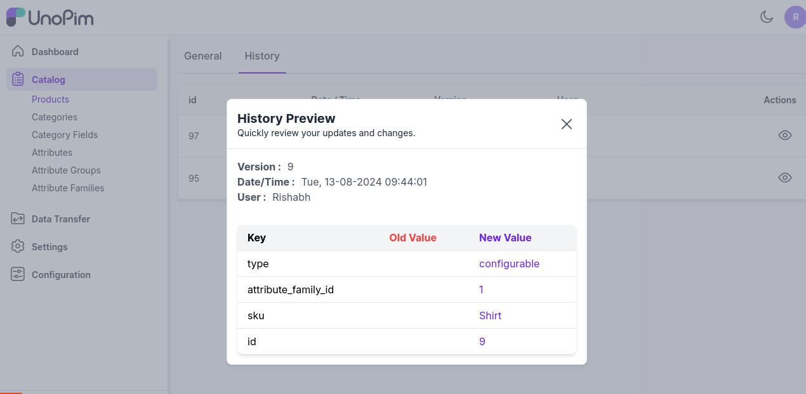 

또한 **CSV, XLS, XLSX** 형식으로 데이터를 **빠르게 내보낼** 수 있습니다.

 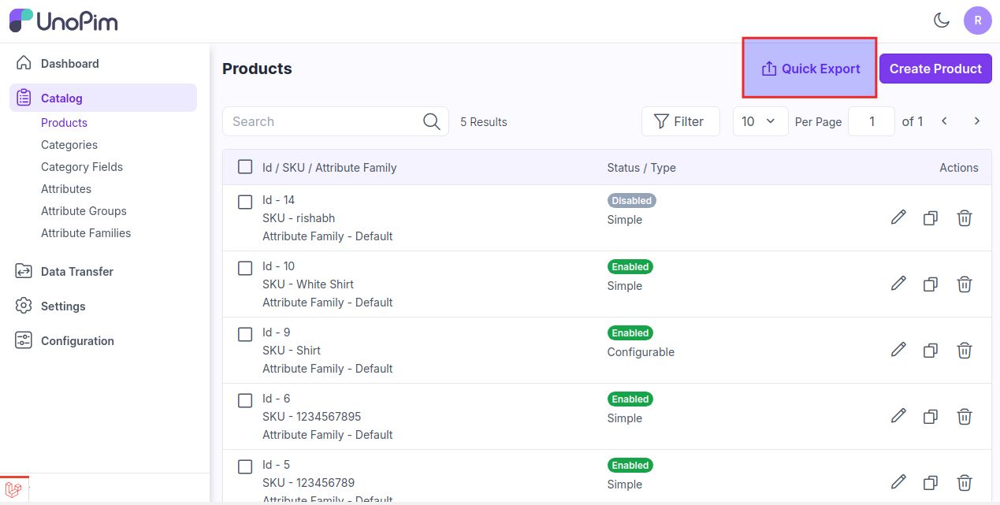 

이제 **빠른 내보내기 버튼**을 클릭하여 데이터를 내보냅니다.

 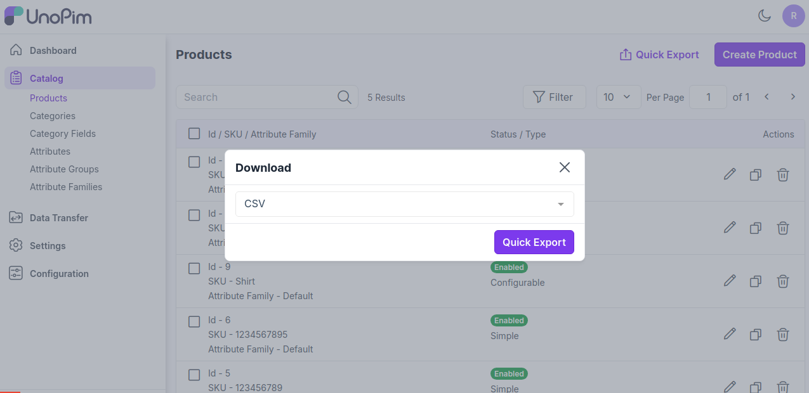 

**참고-** 채널별 값을 지원하는 속성은 채널 배지를 표시하고, 로케일별 값을 지원하는 속성은 로케일 배지를 표시합니다. 속성이 채널별 값과 로케일별 값을 모두 지원하는 경우 두 배지가 모두 표시됩니다.

 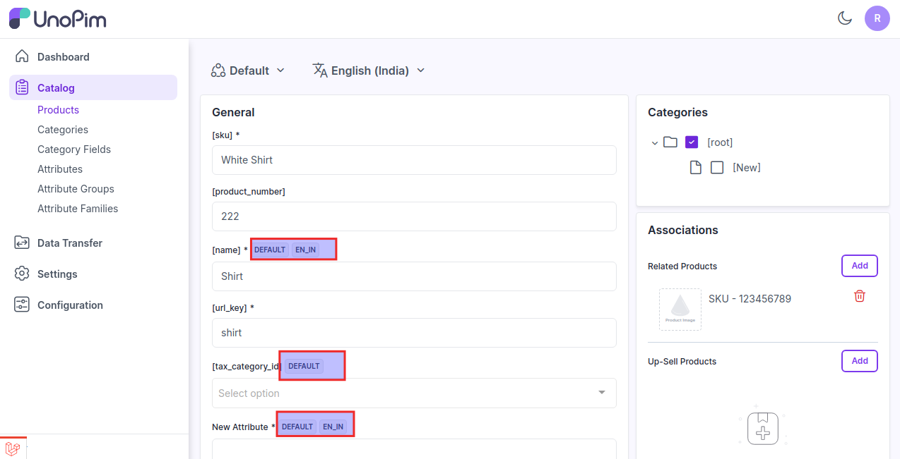 