# 단순 제품

단순 제품은 가장 기본적이고 일반적인 제품 유형입니다. 다른 변형이 없는 물리적이고 독립적인 단일 제품입니다.

단순 제품은 단일 SKU 내에서 사용자 정의 옵션을 제공합니다.

이것은 [UnoPim](https://unopim.com/)에서 단순 제품을 추가하는 방법에 대한 단계별 튜토리얼입니다.

### UnoPim에서 단순 제품 생성하기
1. **카탈로그 >> 제품 >>** 제품 유형 **단순**, **패밀리**를 선택하고 **SKU**를 입력합니다.

 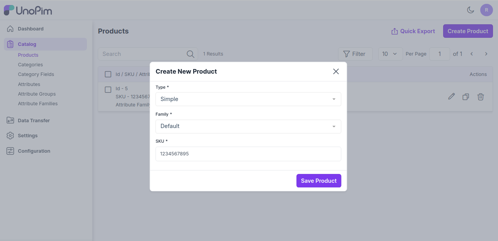 

이제 **제품 저장**을 클릭하면 아래와 같이 제품 편집 페이지로 이동합니다.

### 일반 속성

제품의 패밀리에 할당된 속성들이 속성 그룹별로 그룹화되어 표시됩니다.

아래는 "기본" 패밀리에 있는 필수 속성들입니다:

1) 제품의 **SKU** 입력

2) 제품의 **이름** 입력

3) 제품의 **URL 키** 입력
 
 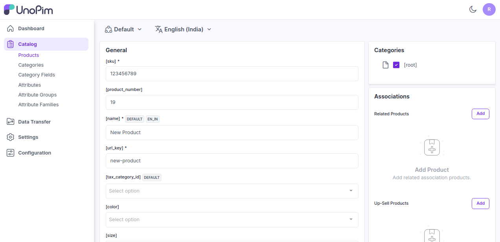

### 간단한 설명
제품의 특징에 대한 간단한 설명을 입력합니다.

### 상세 설명
제품에 대해 자세히 설명합니다.

 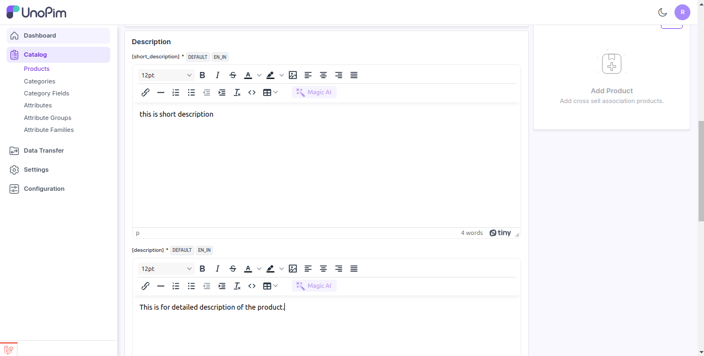 

### 가격
아래 이미지와 같이 제품의 가격과 원가를 입력합니다.

 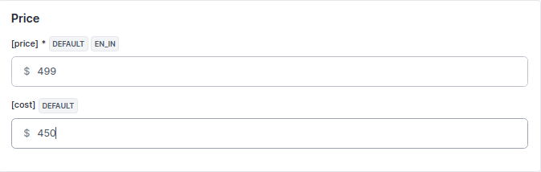

### 기술적 정보

아래와 같이 상태 옵션에서 제품을 활성화합니다.

  

### 카테고리

아래 이미지와 같이 제품을 루트 카테고리에 할당할 수 있습니다.

 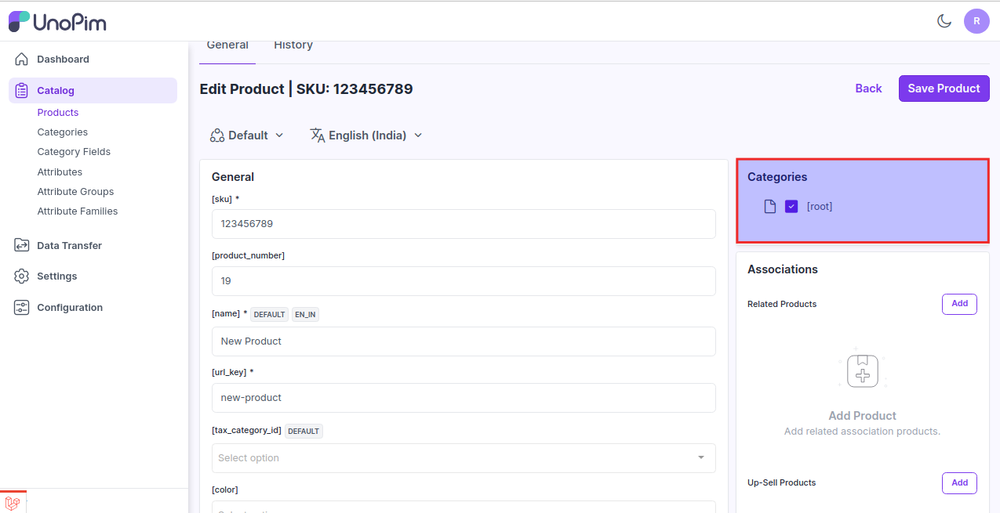 

### 연관 제품

관련 제품, 업셀 제품, 크로스셀 제품을 추가할 수 있습니다.

**1) 관련 제품 -** 관련 제품은 선택한 제품과 유사한 제품들입니다.

잠재적인 대체 제품을 표시하여 고객이 좋아할 만한 다른 유사 제품을 발견할 수 있도록 도와줍니다.

관련 제품을 추가하려면 관련 제품 섹션에서 추가를 클릭하고, 관련 제품으로 추가하고 싶은 제품의 SKU를 통해 검색합니다.

 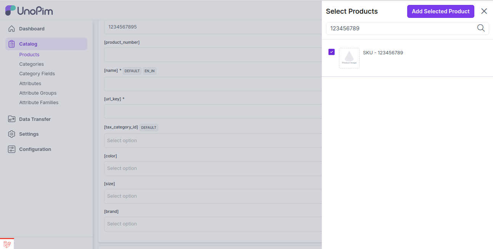 

이제 **선택한 제품 추가** 버튼을 클릭합니다.

**2) 업셀 제품 -** 업셀링은 고객이 관심 있는 제품의 상위 버전을 판매하는 방식입니다.

예를 들어, 전자제품 소매업자가 더 나은 TV, 더 빠른 노트북, 더 내구성이 좋은 태블릿의 장점을 강조하는 것이 업셀링의 예입니다.

업셀 제품을 추가하려면 업셀 제품 섹션에서 추가를 클릭하고, 업셀 제품으로 추가하고 싶은 제품의 SKU를 통해 검색합니다.

  

이제 **선택한 제품 추가** 버튼을 클릭합니다.

**3) 크로스셀 제품 -** 크로스셀은 현재 제품을 기반으로 홍보하는 제품들입니다. 일반적으로 보완적인 품목들입니다.

예를 들어, 노트북을 판매하는 경우 크로스셀 제품은 보호 케이스, 스티커 또는 특별한 어댑터가 될 수 있습니다.

크로스셀 제품을 추가하려면 크로스셀 제품 섹션에서 추가를 클릭하고, 크로스셀 제품으로 추가하고 싶은 제품의 SKU를 통해 검색합니다.

  

이제 **선택한 제품 추가** 버튼을 클릭합니다.

필요에 따라 원하는 만큼 많은 제품을 추가할 수 있습니다.

마지막으로 **제품 저장**을 클릭합니다.

 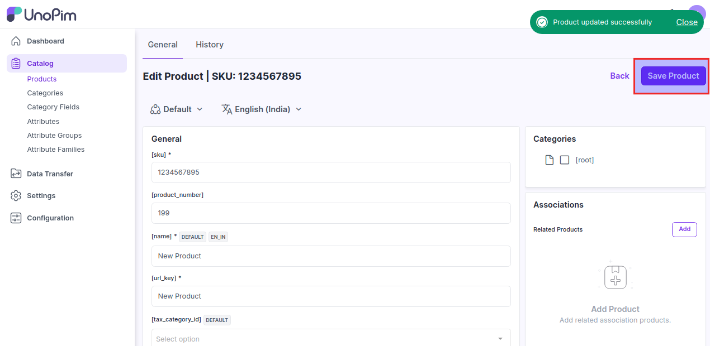 

이제 제품이 성공적으로 생성되었으며 아래 이미지와 같이 **제품 데이터 그리드**에 표시됩니다.

 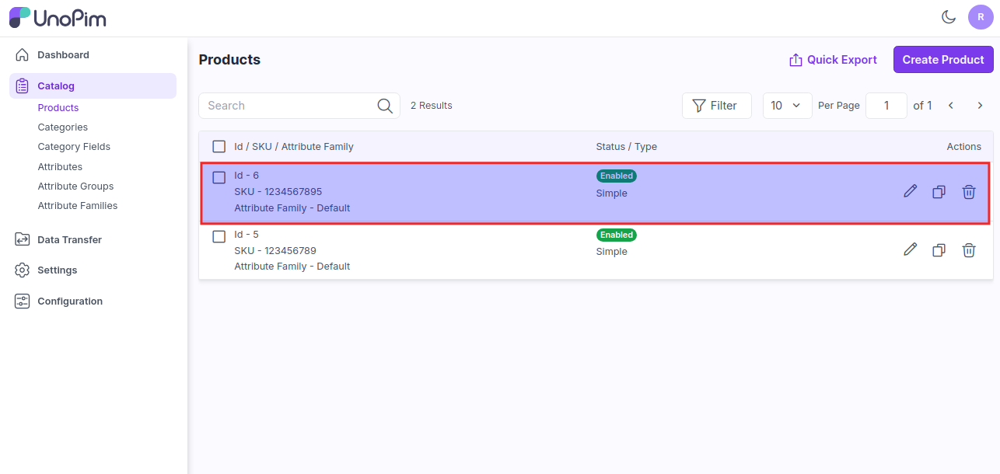 

추가로, **카탈로그 >> 제품 >> 제품 편집**으로 이동하여 **기록**을 클릭하면 제품 기록을 볼 수 있습니다.

 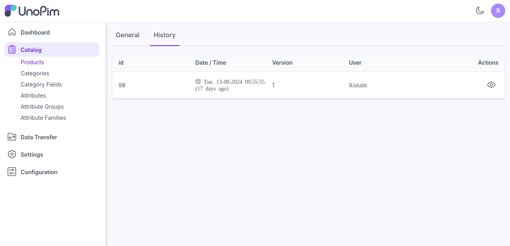 

그 후, **작업**에서 아래와 같이 제품 기록을 볼 수 있습니다.

 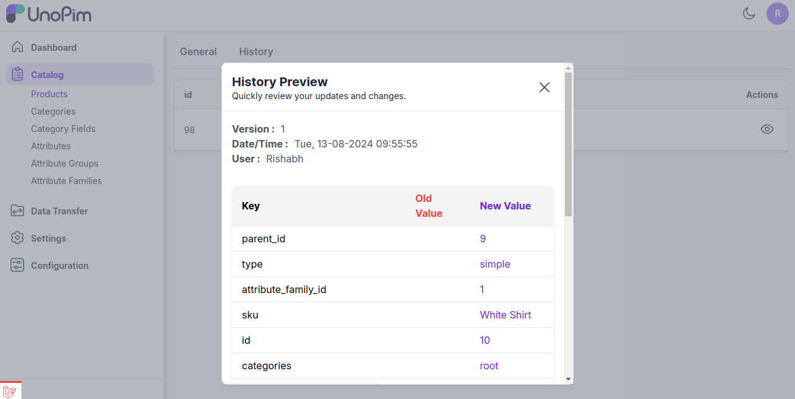 

또한 데이터를 CSV, XLS 또는 XLSX 형식으로 빠르게 내보낼 수 있습니다.

 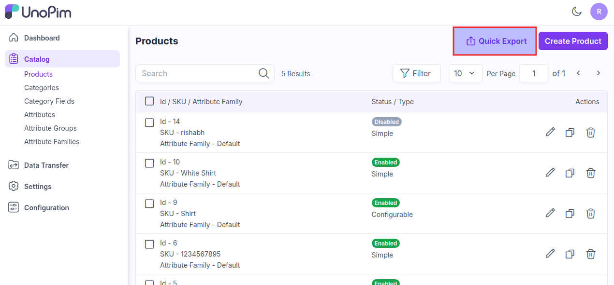 

이제 **빠른 내보내기 버튼**을 클릭하여 데이터를 내보냅니다.

 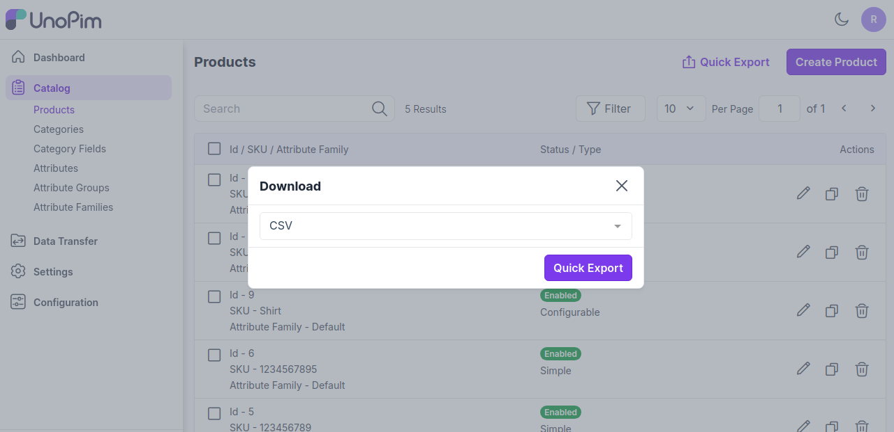 

**참고-** 채널별 값을 지원하는 속성은 채널 배지를 표시하고, 로케일별 값을 지원하는 속성은 로케일 배지를 표시합니다. 속성이 채널별 값과 로케일별 값을 모두 지원하는 경우 두 배지가 모두 표시됩니다.

  
