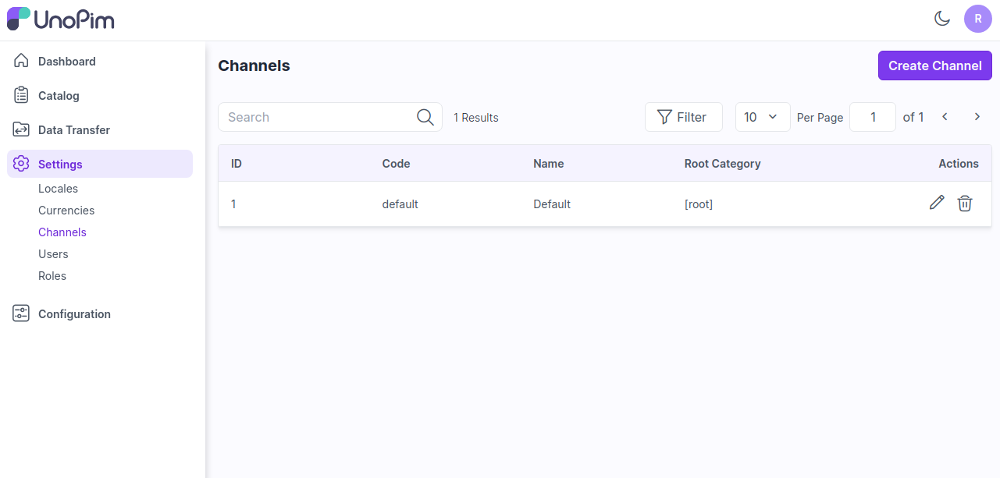
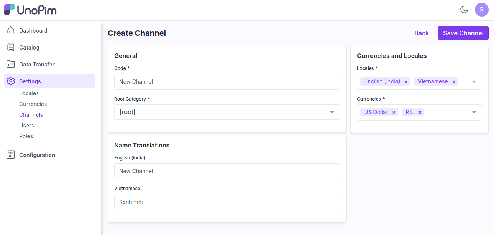
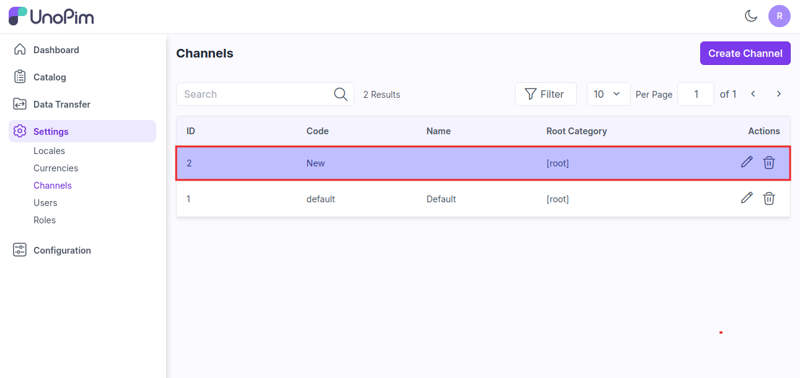
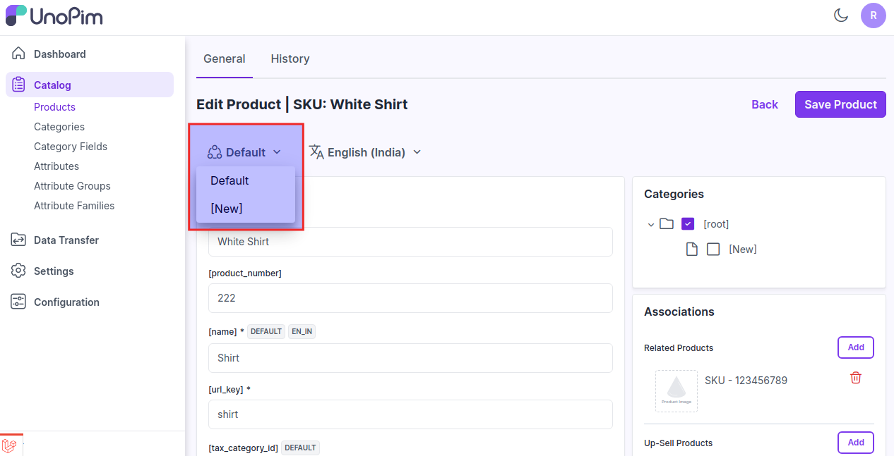

# 채널

채널은 제품 정보가 다양한 접점과 플랫폼에서 정확하고 일관되게 표시되도록 도와줍니다.

### UnoPim에서 채널 생성하기

**1단계:** UnoPim의 채널 기능을 사용하면 UnoPim에서 여러 채널을 생성할 수 있습니다. 여기서는 아래 이미지와 같이 **설정 >> 채널 >> 채널 생성**으로 이동해야 합니다.

 

### 일반

다음은 일반 섹션에 속하는 필드입니다.

**1.코드:** 채널의 코드를 제공합니다.

**2.루트 카테고리:** 드롭다운에서 루트 카테고리를 선택합니다.

**3.이름 번역:** 로케일에 따라 채널의 번역을 입력합니다.

**4.로케일 및 통화:** 채널의 로케일 및 통화를 입력합니다.

 

마지막으로 **채널 저장**을 클릭합니다.

  

이제 새 채널이 제품 편집 페이지에 표시됩니다. 아래와 같이 **카탈로그 >> 제품 >> 제품 편집**을 클릭하세요.

채널을 변경한 후, 채널별 값 속성에 대한 제품 값이 이제 다릅니다.

  

이렇게 하면 UnoPim에서 쉽게 채널을 생성할 수 있습니다.