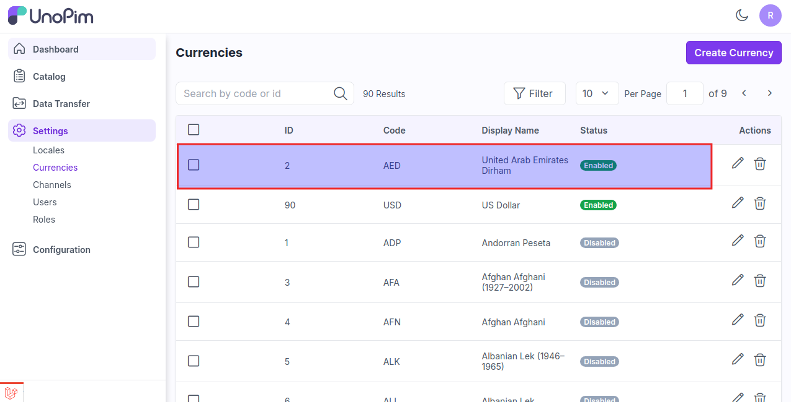
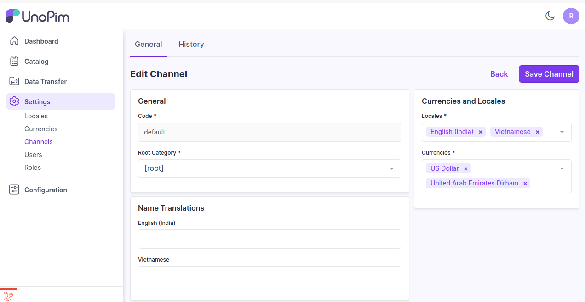

# 통화

UnoPim의 통화는 다양한 시장과 지역에서 제품 가격 및 재무 데이터를 관리하고 표시하는 데 사용되는 다양한 통화 시스템을 말합니다.

### UnoPim에서 통화 추가하기

**1단계:** UnoPim의 관리자 패널에서 **설정 >> 통화 >> 통화 생성**으로 이동합니다.

 

**2단계:** 이제 **코드, 기호, 소수점**을 입력한 다음 **상태**를 활성화하고 아래 이미지와 같이 **통화 저장** 버튼을 클릭합니다.

 

**3단계:** 이제 통화 데이터 그리드에서 새 **통화**를 볼 수 있습니다.

 

**4단계:** 관리자 패널에서 **설정 >> 채널**을 클릭하면 새 통화가 통화 섹션에 표시되는 것을 볼 수 있습니다.

채널 설정이 완료되면 아래 이미지와 같이 **채널 저장**을 클릭합니다.

 

**5단계:** 이 통화를 채널에 추가한 후, 제품 편집 페이지의 가격 유형 속성에 표시되어 다양한 통화에 대한 가격 값을 관리할 수 있습니다.

 

이렇게 하면 UnoPim에서 쉽게 **통화**를 생성할 수 있습니다.   

