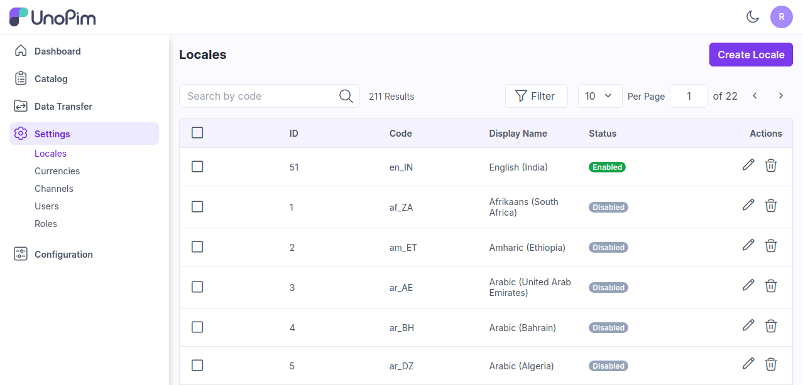
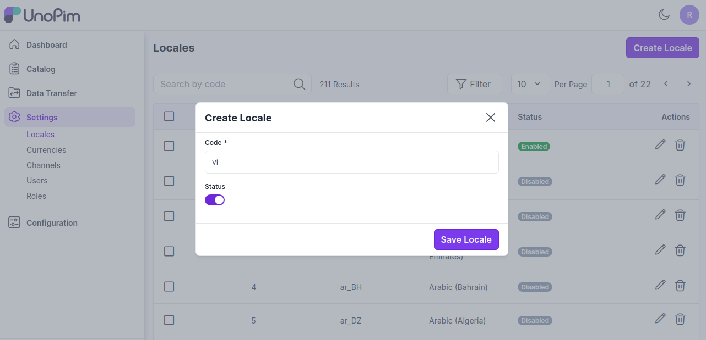
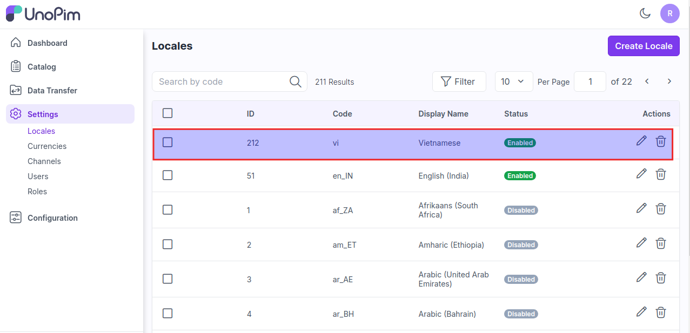
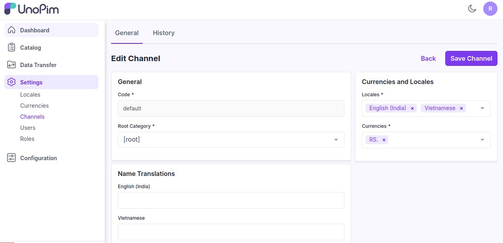
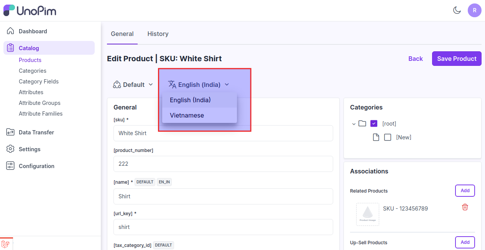

# 로케일

이는 언어, 통화, 날짜 형식 및 기타 로케일별 세부 정보를 포함하여 제품 정보가 표시되는 방식을 결정하는 지역 또는 문화적 설정을 말합니다.

### UnoPim에서 로케일 설정하기

여기서는 UnoPim에서 로케일을 설정하는 단계를 설명합니다.

**1단계:** UnoPim의 관리자 패널에서 **설정 >> 로케일 >> 로케일 생성**으로 이동합니다.

 

**2단계:** 이제 다음 필드를 추가합니다.

**1.코드** 모든 언어는 고유한 코드를 가집니다.

**2.상태** 로케일의 상태를 활성화합니다.

**3단계** 이제 아래 이미지와 같이 새 로케일이 성공적으로 생성되었습니다.

**4단계:** 관리자 패널에서 **설정 >> 채널**을 열면 새 언어가 통화 및 로케일 섹션에 표시되는 것을 볼 수 있습니다. 이를 활성화하려면 로케일을 선택한 다음 아래 이미지와 같이 **채널 저장**을 클릭합니다.

이렇게 하면 UnoPim에서 쉽게 **로케일**을 생성할 수 있습니다.

**5단계:** 이제 이 로케일은 제품 편집 페이지의 로케일 전환기에서 볼 수 있습니다.

로케일을 변경한 후, 로케일별 값 속성에 대한 제품 값이 이제 다릅니다.

