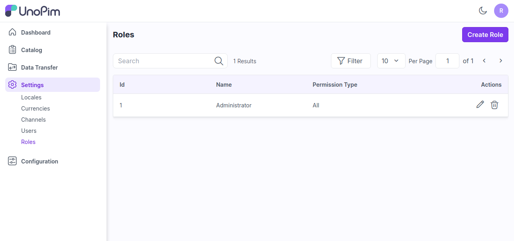
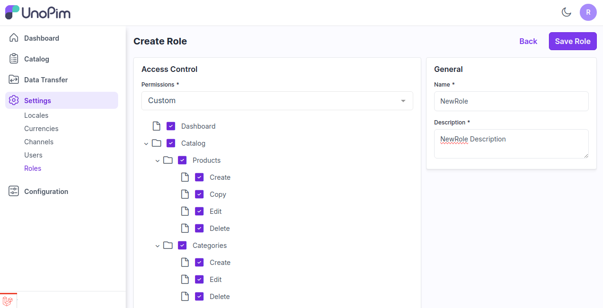
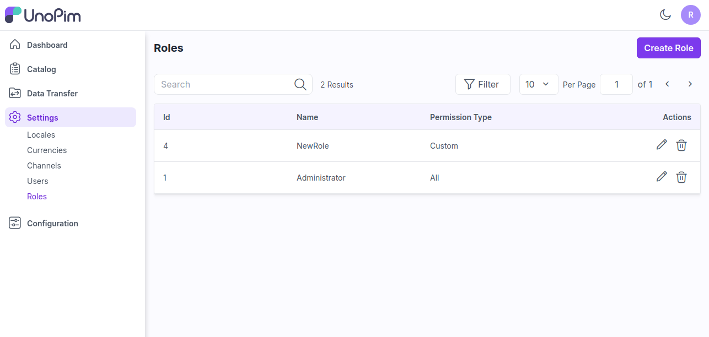
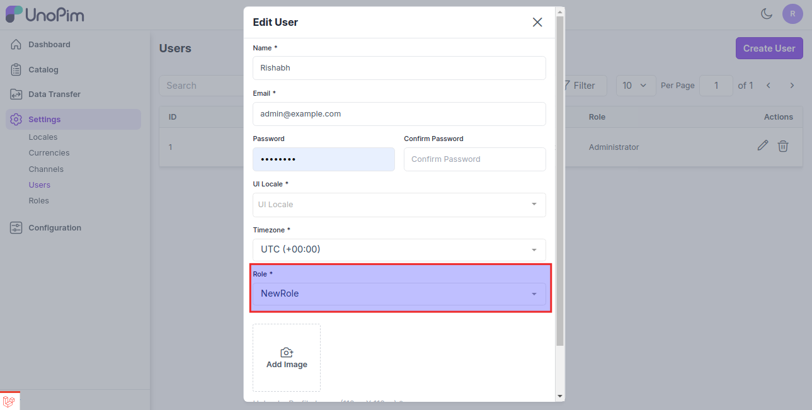
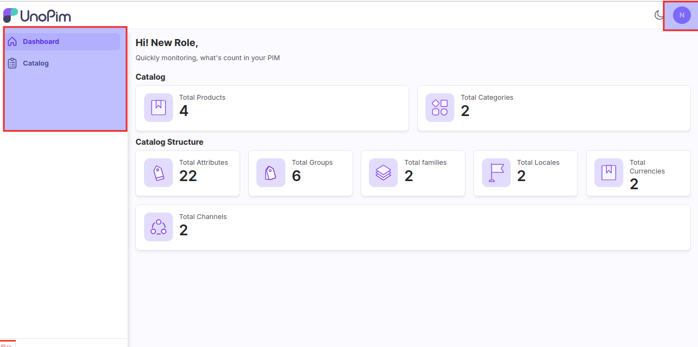

# 역할

이는 시스템 내에서 사용자에게 할당된 특정 기능이나 책임을 말하며, 제품 데이터를 관리하고 유지하는 것과 관련된 접근 수준과 작업을 정의합니다.

### 역할 생성하기

**1단계:** 관리자 패널에서 **설정 >> 역할**로 이동하여 설정할 수 있습니다. 여기서 아래 이미지와 같이 **역할 생성** 버튼을 클릭하여 새 역할을 생성할 수 있습니다.

 

**2단계:** 다음 필드를 추가합니다.

**1) 권한:** 옵션 **사용자 정의 및 전체**에서 권한을 선택합니다.

* **사용자 정의-** 사용자에 대한 요구 사항에 따라 메뉴를 표시하려면 사용자 정의 옵션을 선택합니다.

* **전체-** 사용자에게 모든 메뉴를 표시하려면 전체 옵션을 선택합니다.

2) **이름:** 역할의 이름을 입력합니다.

3) **설명:** 역할에 대한 설명을 입력합니다.

 

**3단계:** 이제 **역할 저장**을 클릭하면 역할 데이터 그리드에 새 역할이 성공적으로 생성됩니다.

 

**4단계:** 이제 사용자를 생성할 때 이 새 역할을 할당할 수 있습니다. 아래 이미지와 같이 **설정 >> 사용자**로 이동합니다.

 

**5단계:** 이제 새 사용자로 로그인하고 아래 이미지와 같이 할당된 사용자 정의 권한이 있는 새 사용자를 확인합니다.

 

이렇게 하면 UnoPim에서 쉽게 역할을 생성할 수 있습니다.

