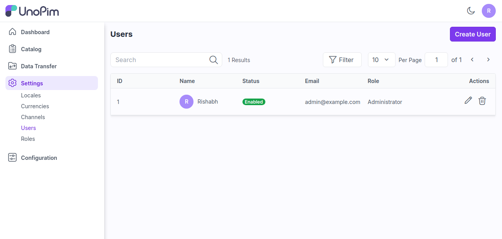
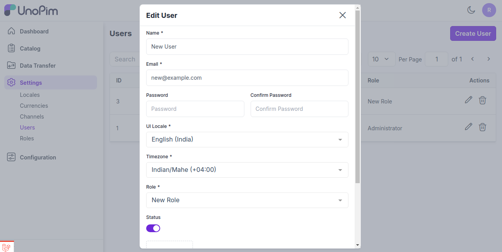
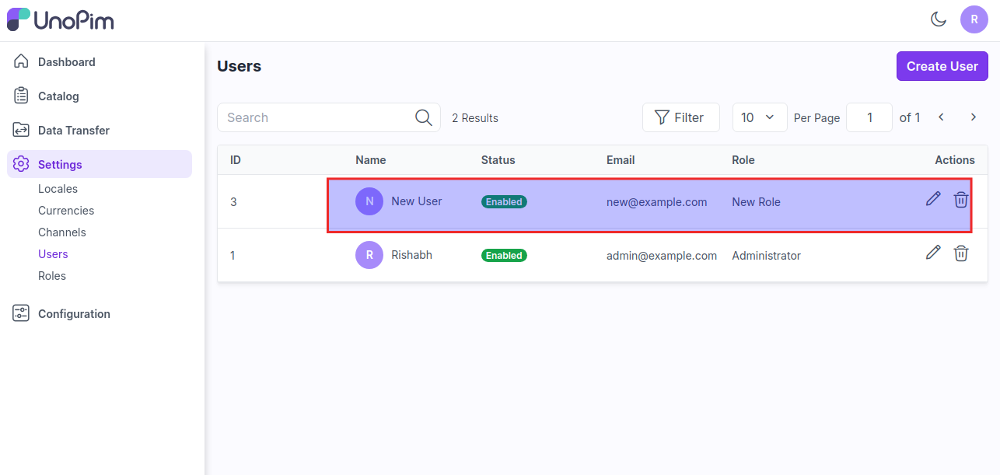

# 사용자

이는 제품 관리자, 콘텐츠 제작자, 마케터 및 관리자와 같은 역할을 포함하여 시스템과 상호 작용하는 개인을 말하며, 각각 제품 데이터를 관리하고 유지하는 데 특정 권한 및 접근 수준을 가집니다.

### UnoPim에서 사용자 생성하는 단계

**1단계:** 관리자 패널에서 **설정 >> 사용자**로 이동하여 설정할 수 있습니다. 여기서 아래 이미지와 같이 **사용자 생성** 버튼을 클릭하여 새 사용자를 생성할 수 있습니다.

**2단계:** 이제 다음 필드를 추가합니다.

1) **이름 -** 사용자의 이름을 입력합니다.

2) **이메일 -** 사용자의 이메일을 입력합니다.

3) **비밀번호 -** 사용자의 비밀번호를 입력합니다.

4) **UI 로케일 -** 새 사용자를 표시할 로케일을 선택합니다.

5) **시간대 -** 사용자에 따라 시간대를 선택합니다.

6) **역할 -** 사용자의 역할을 선택합니다.

7) **상태 -** 사용자의 상태를 활성화합니다.

8) **이미지 -** 사용자의 이미지를 추가할 수도 있습니다.

마지막으로 **사용자 저장** 버튼을 클릭합니다.

  

**3단계:** 이제 아래 이미지와 같이 사용자 데이터 그리드에 새 사용자가 성공적으로 생성되었습니다.

  

이렇게 하면 UnoPim에서 쉽게 사용자를 생성할 수 있습니다.